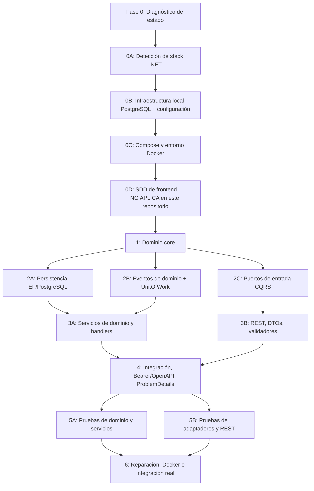

# SDD — Orquestador agéntico del backend Zentric

> `[CONFIRMADO]` **Tablero vigente:** `main` con los commits locales de esta sesión (sin pushear) · build con `-warnaserror`: **0 errores, 0 warnings** · **399/399 pruebas PASS** · smoke de autorización en Docker: **69 comprobaciones, 0 fallos** · re-verificación ejecutada: **2026-09-29**. Comandos: `dotnet build Zentric.slnx -warnaserror` → `Build succeeded. 0 Warning(s) 0 Error(s)`; `dotnet test Zentric.slnx --no-build` → `Passed! Failed: 0, Passed: 399, Total: 399`; `pwsh -File backend/scripts/authorization-smoke.ps1` → `TOTAL DE COMPROBACIONES: 69 | FALLOS: 0` (exit 0). Conteos: **30** endpoints en controladores + `GET /health` = **31 rutas**; **18** políticas de autorización; **10** `DbSet`; **10** mappers; **10** repositorios; **7** migraciones EF; **44** archivos de suite (43 con casos + `ManualClock`). **H-15 cerrado en esta sesión** (ver bloque siguiente).
>
> `[CONFIRMADO]` **Q-21b CERRADA 2026-09-29 (`ADR-0013`) — propiedad del recurso, incluido el contrato HTTP.** Dictada por el Owner en dos rondas: opción **A (estricta completa)** + P1 `VendorId = User.Id`, P2 vista filtrada del vendedor, P3 facturas por rol, P4 los 7 sub-puntos de escrituras. Implementado en tres entregas: **E1** identidad en escrituras del Comprador (carrito sin `buyerId` en el cuerpo; ítems/checkout/pago/devolución con filtro por comprador; accessor renombrado a `ICurrentUserAccessor`), **E2** lecturas de detalle por dueño (pedido, facturas, devoluciones, despachos) incluida la **vista filtrada** del vendedor (`SellerOrderViewDto`), **E3** listados y escrituras del Vendedor (bodegas encerradas, stock por dueño de producto, fulfillment/dispatch/approve por dueño, `vendorId` del producto derivado del token). **Bug real encontrado por el smoke y corregido (H-15)**: 5 endpoints fallaban con `another instance with the same key value is already being tracked` al leer y actualizar la misma fila en un request (aprobar/inspeccionar devolución, despachar, cancelar por quiebre, publicar producto) — ninguna prueba unitaria lo detectaba porque los fakes en memoria no pasan por EF. Corregido con `AsNoTracking()` en las lecturas de los 6 repositorios afectados. **Y una incoherencia del propio ADR, resuelta en un tercer dictamen del Owner:** el ADR decía que un recurso ajeno responde `404` "en lecturas y escrituras", pero las escrituras seguían devolviendo `400` (17 llamadas a `BadRequest` frente a 8 a `NotFound`). El objetivo de seguridad ya se cumplía porque el mensaje era el mismo, pero el contrato era ambiguo. **Dictamen: `404` uniforme**, resolviendo el fallo sin leer el texto del mensaje, con `ErrorKind` en el `Result` y un mapeo único (`ResultMapping.ToProblem()`) en la capa de presentación; `ResultMappingTests` escanea los controladores y falla si alguien vuelve a elegir el código a mano (probado por mutación). **Limpieza en la misma jornada**: 17 `TODO` de eventos de dominio que no existen (los 6 eventos reales sí están implementados) y 4 métodos con cero llamadas (`SuspendCommerceActivity`, `ResumeCommerceActivity`, `Product.UpdateName`, `Product.UpdateDescription`). Verificado: `dotnet build -warnaserror` 0/0 · `dotnet test` **399/399** · smoke **69/69** en Docker con PostgreSQL real. **Se reparó además un 404 de más**: `GET /api/orders/{id}` filtraba por comprador sin mirar rol, así que Admin/Supervisor/Operador no podían leer ningún pedido. Spec: [Presentation/02-authorization.md §5](Presentation/02-authorization.md#5-propiedad-del-recurso-confirmado-q-21b-2026-09-29-adr-0013).
>
> `[CONFIRMADO]` **RG-01 CERRADO 2026-09-28 (`ADR-0009`).** La API ya **sí autentica**: login con correo y contraseña, hash PBKDF2-HMAC-SHA256 (600 000 iteraciones) calculado en el servidor, token JWT HS256 de 60 minutos, y **política de reserva** que exige token en todo endpoint. La cabecera `X-Buyer-Id` **fue eliminada**: `ClaimsBuyerAccessor` lee solo el claim `sub` de un token ya validado. Verificado **contra PostgreSQL real en Docker** (13/13 escenarios): registro anónimo de Buyer 200 · login correcto 200 · `/auth/me` devuelve identidad · contraseña incorrecta 401 · correo inexistente 401 · registro de Seller sin token 403 · registro de Seller con token de Buyer 403 · **ataque `X-Buyer-Id` 401** · sin token 401 · **token forjado sin firma 401** · contraseña corta 400 · `/health` anónimo 200. Lectura de vuelta en la base: contraseñas persistidas como `pbkdf2-sha256$600000$...` (90 caracteres, sal única), ninguna en claro. **El smoke encontró y dejó corregido un defecto:** `GET /api/auth/me` devolvía `fullName` vacío porque el token emitía la claim como `unique_name` y el controlador leía `ClaimTypes.Name` (el validador de .NET 10 no reescribe tipos de claim entrantes) — se emite como `name` y quedó cubierto con una aserción en `JwtAuthTokenServiceTests`. Q-21 (autorización por rol, RG-03) **se cerró el 2026-09-29** y **Q-22 (forma de los `enum` en el cuerpo JSON) se cerró el mismo día**: ver los dos bloques siguientes.
>
> `[CONFIRMADO]` **RG-03 CERRADO 2026-09-29 (`ADR-0011`).** Cada una de las **30 acciones** declara una de las **18 políticas** de `Zentric.Api/Security/AuthorizationPolicies.cs`, que es la Matriz de Responsabilidades de ZENTRIC.md §12 con el ADDENDUM, escrita una sola vez. `FallbackPolicy = RequireAuthenticatedUser()`: **una ruta sin decorar nace cerrada**, y el anonimato queda limitado a `POST /api/auth/login`, `POST /api/users` (solo `role = Buyer`) y `GET /health`. Verificado **en dos capas**: por **reflexión** (`EndpointAuthorizationMatrixTests`, 7 casos: ninguna acción sin política, la política declarada coincide con la spec, ninguna política queda muerta, y reglas puntuales de la Ley) con **prueba de mutación** (añadir `Administrator` a `ReturnApprove` → `Failed: 1`, revertido), y **por HTTP real en Docker** con tokens de los cinco roles: **36 comprobaciones, 0 fallos**, incluyendo `GET /api/users` con token de Comprador o Supervisor → `403` (antes devolvía la lista completa) y `POST /api/returns/{id}/approve` con token de Administrador → `403` porque el ADDENDUM Dominio 10 da la aprobación al **Vendedor**. Spec: [Presentation/02-authorization.md](Presentation/02-authorization.md). **Lo que NO cubría** y quedó luego resuelto: propiedad del recurso (**Q-21b** → `ADR-0013`), quién cancela por quiebre de stock (**Q-21c**), quién emite facturas (**Q-21d**) y el conflicto con `frontendSDD/Frontend-Role-Modules.md`, que declaraba cuatro roles y no tenía módulo para `Supervisor` (**Q-21e**): las tres últimas se cerraron juntas el mismo día en [ADR-0014](Adr/0014-enmiendas-a-la-matriz-de-autorizacion.md).
>
> `[CONFIRMADO]` **Q-21c, Q-21d y Q-21e CERRADAS 2026-09-29 (`ADR-0014`).** Tres puntos donde la Ley dejaba sin actor, dictadas por el Owner en una sola ronda. **Q-21c:** el Operador Logístico **sí** cancela por quiebre de stock —el ADDENDUM Dominio 8 se lo asigna al Vendedor, pero el faltante lo detecta quien está en la bodega, y sin la apertura podía preparar, recibir y despachar un paquete sin poder reportar que la mercancía no está. **Q-21d:** solo el **Administrador** emite las facturas, porque el `ZentricDetail` es "control de plataforma"; abrirlo al Vendedor exigiría partir el caso de uso en dos, no cambiar una política. **El dictamen además cerró un defecto real que la spec del endpoint prometía y el código no cumplía:** `GenerateInvoicesCommandHandler` no comprobaba que el pedido estuviera pagado ni que no estuviera ya facturado, así que **un segundo clic duplicaba las tres facturas**; ahora ambos casos son `400`, con 6 pruebas nuevas. **Q-21e:** el `Supervisor` se queda como rol de **solo lectura y auditoría**, **sin módulo propio** —la Ley lo define, así que el documento desactualizado era el del cliente, no el enum. Se corrigió además una etiqueta de evidencia que **sobredeclaraba** la Ley: §12 tiene cuatro columnas y no marca palomita al Admin ni al Supervisor, de modo que la lectura de ambos viene del dictamen de Q-21, no de la tabla. Verificación: build estricto **0/0**, **395/395** pruebas, smoke **69/69** con el caso del Operador pasando de `403` a abierto.
>
> `[CONFIRMADO]` **Q-22 CERRADA 2026-09-29 (`ADR-0012`).** Los `enum` del cuerpo JSON viajan **solo por nombre**: `{"role":"Seller"}` → `200`, `{"role": 2}` → `400`, `{"role":"supervisor"}` en minúsculas → `200` (la lectura del converter de .NET no distingue mayúsculas, verificado por sonda). Registrado en `Zentric.Api/Contracts/EnumJsonContract.cs` (`JsonStringEnumConverter` con `allowIntegerValues: false`) enganchado en `Program.cs`. **La premisa con la que se abrió la pregunta era falsa y se corrigió:** no se tocaban "todos los enum de entrada y salida" — las salidas ya devolvían nombres (`order.Status.ToString()`, `UserDto(…, string Role, …)`), la query ya los aceptaba, y el radio real eran **4 campos de entrada** (`CreateUserCommand.Role`, `CreateProductCommand.Type`, `RequestReturnCommand.ProductType`, `CreateWarehouseCommand.Type`). Además no existía cliente que enviara enteros: `frontend/` no tiene `src/` (0 archivos `.ts`). Prueba de mutación hecha (`allowIntegerValues: true` → `Failed: 1`, revertido) y 3 comprobaciones HTTP nuevas en el smoke. **Efecto en el frontend:** `frontendSDD/Frontend-Adapters.md` §3.2 había que reescribirlo, y de paso corregir que publicaba valores inexistentes (`Seller: 1, Buyer: 2, Admin: 3`; el dominio es `Buyer=0, Seller=1, Administrator=2, Supervisor=3, LogisticsOperator=4`, sin `Supervisor` ni `Cancelled`).

> **Qué es este documento.** Es el **Prompt de Orquestación Agéntica** del backend Zentric: define cómo un agente (o varios) diagnostica el repositorio, elige la siguiente tarea, la ejecuta, la valida y registra evidencia. Es la única **memoria viva** del proyecto: indexa y apunta a la SSoT (no la duplica). El contrato operativo y la arquitectura obligatoria viven en [AGENTS.md](../AGENTS.md); la Ley funcional es [ZENTRIC.md](../ZENTRIC.md).

> **Jerarquía de verdad:** decisión del Owner → [AGENTS.md](../AGENTS.md) → [ZENTRIC.md](../ZENTRIC.md) (Ley, intocable) → resto de `/backendSDD/` → este archivo.

> **Etiquetas de evidencia:** `[CONFIRMADO]` verificado por ejecución o lectura directa · `[OBSERVADO]` visto sin verificación plena · `[INFERIDO]` deducido del contexto · `[SUPUESTO]` asumido (requiere confirmación) · `[PENDIENTE]` por hacer/verificar · `[RIESGO]` riesgo registrado.

> **Estados de trabajo** (definiciones completas en la [sección 3.2](#32-estados-transiciones-y-límites)): `NOT_STARTED → PARTIAL → IMPLEMENTED → VERIFIED`; cualquier estado puede degradar a `FAILING`. Marcas usadas en las tablas: ✅ implementado/verificado · ⚠️ parcial · 🟡 no iniciado · ❌ fallando.

**Navegación:** [0. Entrega](#0-entrega-y-organización-del-repositorio) · [1. Orquestador](#1-identificación-y-configuración-del-agente-orquestador) · [2. Fases](#2-mapa-de-fases-paralelización-y-dependencias) · [3. Instrucciones](#3-instrucciones-ejecutivas-del-orquestador) · [4. Fases detalladas](#4-fases-detalladas-fase-0a--fase-6) · [5. Mapa](#5-mapa-de-entidades-anti-amnesia) · [6. Specs](#6-índice-de-especificaciones-ssot) · [7. Estado](#7-estado-de-implementación-por-capa) · [8. Decisiones](#8-decisiones-adrs-y-addenda) · [9. Preguntas](#9-preguntas-abiertas-y-bloqueos) · [10. Riesgos](#10-riesgos-hallazgos-y-observaciones) · [11. Verificación](#11-verificación-gates-y-criterios-de-finalización) · [12. Registro](#12-registro-de-acciones-y-control-del-documento) · [13. Normativa](#13-cumplimiento-normativo-y-estándares-vigentes-verificado-2026-09-26) · [14. Matriz 360°](#14-matriz-de-cobertura-360-dimensiones-aplicables) · [15. Auditoría](#15-auditoría-de-mapeo-de-entidades-formato-de-la-metodología) · [16. Trazabilidad](#16-trazabilidad-con-la-metodología-v600) · [17. Research Log](#17-research-log-2026-09-26-verificación-de-estándares-vigentes) · [18. SPEC-008](#18-spec-008--fase-6-reparación-docker-e-integración-real)

## 0. Entrega y organización del repositorio

`Zentric` es un **monorepo** con dos aplicaciones y sus especificaciones separadas.
Este documento orquesta **el backend**; la especificación del frontend vive en
[`../frontendSDD/`](../frontendSDD/). Estructura física obligatoria:

```text
Zentric/
├── backend/                     # API .NET 10 (solución Zentric.slnx, 5 proyectos)
│   ├── Zentric.Domain/           # Núcleo puro (DDD). Sin dependencias externas.
│   ├── Zentric.Application/      # Casos de uso CQRS, validación, Result, puertos.
│   ├── Zentric.Infrastructure/   # EF Core + PostgreSQL, mappers, repositorios, background services.
│   ├── Zentric.Api/              # Composition Root + controladores REST (30 endpoints + /health).
│   ├── Zentric.Tests/            # xUnit (39 archivos de suite, 341 casos).
│   ├── Zentric.slnx
│   └── Dockerfile                # Imagen multi-stage de la API (contexto raíz, puerto 8080).
├── frontend/                    # Consola web React + TypeScript (solo configuración base).
├── backendSDD/                  # SSoT del backend: especificaciones por capa, ADRs y este orquestador.
├── frontendSDD/                 # SSoT del frontend: arquitectura, contratos, flujos y design system.
├── .github/workflows/ci.yml     # CI (backend: restore+build+test; frontend: npm ci+build).
├── docker-compose.yml           # PostgreSQL 16.15 + API + frontend.
├── .dockerignore · .env.example
└── AGENTS.md · ZENTRIC.md · README.md · LICENSE · .editorconfig
```

Reglas de organización:

1. Ningún código de producción del backend puede vivir fuera de `backend/Zentric.*` (más `Zentric.Tests`).
2. Todo el código del frontend vive bajo `frontend/`; su especificación bajo `frontendSDD/`.
3. Toda entidad nueva recorre las 5 etapas: Dominio → Aplicación (CQRS) → Infraestructura (mapeo + repositorio) → Api (endpoint) → Tests; y se registra en el mapa de la sección 5.
4. **Ajenos / generados (clasificados, no mapeados):** `bin/`, `obj/`, `.git/`, `.agents/`, `.github/`, `LICENSE`, `.gitignore`, `.vscode/`, `appsettings.Development.json`, `node_modules/`.
5. Si se parte de una estructura heredada, se migra completa (imports, Docker, Compose, CI, README y pruebas) y se verifica que no queden referencias al path anterior.

## 1. Identificación y configuración del agente orquestador

### 1.1 Rol, objetivo y alcance

- **Rol:** Agente Orquestador Principal / Lead Software Architect del backend Zentric.
- **Objetivo:** determinar el estado real del repositorio y ejecutar únicamente el siguiente trabajo necesario. Reanudar lo implementado sin regenerarlo, reparar fallos antes de avanzar y paralelizar sub-agentes solo cuando sus dependencias y archivos no se solapen.
- **Propósito del sistema** `[OBSERVADO]`: API central y núcleo de dominio de **Zentric**, plataforma que intermedia entre **Comprador** y **Vendedor** administrando usuarios, catálogo, inventario distribuido, pedidos, facturación, logística y posventa.
- **Owner:** no registrado en el repositorio `[PENDIENTE]`; las decisiones se dictan por chat y quedan registradas como ADDENDUM en la Ley o como ADR en `backendSDD/Adr/`.
- **Biblia (intocable, [AGENTS.md, sección 0.7](../AGENTS.md#07-inmutabilidad-de-los-documentos-biblia-y-registro-de-cambios)):** [ZENTRIC.md](../ZENTRIC.md). Integridad verificada el 2026-09-18 (`git diff --numstat` = 38 adiciones / 1 borrado, y el borrado fue una línea separadora). Las adiciones están dictadas por el Owner: ADD-001…ADD-003 ([sección 8.2](#82-adiciones-a-la-biblia-addendum---dictado-por-owner-en-zentricmd)).
- **Alcance incluido:** dominio de marketplace completo (identidad, catálogo, bodegas, inventario, pedidos, logística, devoluciones, facturación), API REST y persistencia PostgreSQL.
- **Fuera de alcance:** UI, apps móviles, portales, autenticación técnica real y almacenamiento según el alcance incluido y excluido de [01-system-overview.md](01-system-overview.md). Swagger ya prepara el esquema `Bearer` para cuando se formalice Auth.

### 1.2 Entorno local, stack y comandos oficiales

| Recurso | Valor |
|---|---|
| Lenguaje / runtime | C# · .NET 10 (`net10.0`) |
| Arquitectura | Hexagonal (puertos y adaptadores) + DDD táctico + CQRS + Result Pattern |
| Mediación / validación | Dispatcher propio (`ADR-0007`, en sustitución de MediatR por licencia RPL 1.5) · FluentValidation 12.1.1 |
| Persistencia | EF Core + Npgsql 10.0.3 sobre **PostgreSQL 16** (contenedor `zentric-postgres`, puerto `5432`, base `ZentricDb`) |
| API | ASP.NET Core + OpenAPI/Swagger (XML docs, tags, RFC 9457) · **JWT HS256 + PBKDF2 (`ADR-0009`)** |
| Pruebas | xUnit 2.9.3 (39 archivos, 341 casos) |
| Contenedores | `Dockerfile` multi-stage (EXPOSE 8080) + `docker-compose.yml` (API en `5076:8080`, base en `5432:5432`) |
| CI | `.github/workflows/ci.yml` (restore + build + test; dispara solo en push/PR a `main`) |

Comandos oficiales ([AGENTS.md, [sección 7](#7-estado-de-implementación-por-capa)](../AGENTS.md#7-comandos-de-verificación-y-compilación)):

```powershell
cd backend; dotnet restore Zentric.slnx
cd backend; dotnet build Zentric.slnx
cd backend; dotnet test Zentric.slnx
```

Infraestructura local (resumen real de `docker-compose.yml`):

```yaml
services:
  db:                       # imagen postgres:16-alpine · contenedor zentric-postgres
    environment: { POSTGRES_USER: postgres, POSTGRES_PASSWORD: postgres, POSTGRES_DB: ZentricDb }
    ports: ["5432:5432"]    # volumen persistente zentric_pgdata
  api:                      # imagen zentric:latest · contenedor zentric-api
    environment: { ConnectionStrings__DefaultConnection: "Host=db;Port=5432;Database=ZentricDb;..." }
    ports: ["5076:8080"]
```

Regla: dentro de Docker la API usa el nombre de servicio `db`, nunca `localhost`. `[RIESGO]` Las credenciales de desarrollo están en claro (`appsettings.json` y compose); mover a variables de entorno antes de producción (observación OBS-04, [sección 10](#10-riesgos-hallazgos-y-observaciones)).

### 1.3 Registro de agentes y formato de delegación

Los nombres `domain-architect`, `infrastructure-adapter`, etc. son **roles lógicos** (definidos en [AGENTS.md, [sección 4](#4-fases-detalladas-fase-0a--fase-6)](../AGENTS.md#4-roles-de-agentes-especializados)), no agentes obligatoriamente instalados. Antes de delegar, el orquestador asigna cada rol a un agente disponible por capacidad; si no existe un agente especializado, usa un agente general de ejecución conservando el mismo alcance, archivos y gate.

| Rol lógico ([AGENTS.md, [sección 4](#4-fases-detalladas-fase-0a--fase-6)](../AGENTS.md#4-roles-de-agentes-especializados)) | Alcance |
|---|---|
| Domain-Architect-Agent | Entidades, agregados, value objects, invariantes, eventos, puertos y specs de `backendSDD/Domain/` |
| Infrastructure-Adapter-Agent | `DbModel` + mappers + repositorios + migraciones + background services |
| Application-API-Agent | Commands/Queries, DTOs, validadores, controladores, Problem Details |
| QA-Testing-Agent | Pruebas BDD de dominio y aplicación (xUnit) y arneses de DI |

Toda delegación debe incluir siempre: (1) rol lógico, (2) stack detectado, (3) documentos SDD de entrada, (4) archivos permitidos, (5) archivos prohibidos, (6) dependencias, (7) criterio de salida, (8) comando de validación y (9) formato de reporte. No se inventan nombres de agentes ni se asume que un agente puede editar fuera de su alcance.

## 2. Mapa de fases, paralelización y dependencias

### 2.1 Diagrama de fases

El flujo es un ciclo de diagnóstico, diseño, implementación, containerización, reparación y validación, con fases `0A` a `6`. Las tareas paralelas solo se ejecutan cuando el diagnóstico confirma dependencias satisfechas y archivos sin solape.



### 2.2 Tablero de fases (estado real al 2026-09-26)

| Fase | Entregables | Estado | Evidencia | Gate pendiente |
|---|---|---|---|---|
| 0A | Detección de stack | ✅ `VERIFIED` | 5 `.csproj` net10.0 + `Zentric.slnx` | — |
| 0B | PostgreSQL + configuración | ✅ `VERIFIED` | `postgres:16.15-alpine` saludable; 7 migraciones aplicadas; 13 tablas reales | — |
| 0C | Compose y entorno Docker | ✅ `VERIFIED` | `docker compose build` exit 0; `up` con healthcheck; `/health` → 200 `{"status":"healthy","database":"up"}` | — |
| 0D | SDD de frontend | ✅ `VERIFIED` | `frontendSDD/` con 8 documentos (orquestador, arquitectura, servicios, adaptadores, módulos por rol, design system, flujos y auditoría de contrato) | — |
| 1 | Dominio core (9 agregados, VOs, puertos, eventos) | ✅ `VERIFIED` | 341/341 pruebas | — |
| 2A | Persistencia EF + mappers + repositorios | ⚠️ `IMPLEMENTED` | 10 `DbSet`, 10 mappers, 10 repositorios | Gate de integración real (OBS-03) |
| 2B | Eventos + `UnitOfWork` | ✅ `IMPLEMENTED` | `DomainEventDispatcher`; flujo Devoluciones→Inventario | Cobertura directa del dispatcher |
| 2C | CQRS de entrada (16 commands, 8 queries) | ✅ `VERIFIED` | 13 suites de handlers + validadores | — |
| 3A | Servicios de dominio y casos de uso | ✅ `VERIFIED` | `InventoryReservationService`, `ReturnsApprovalService`, checkout | — |
| 3B | REST, DTOs, validadores | ⚠️ `PARTIAL` | 30 endpoints, RFC 9457, Swagger | Pruebas HTTP E2E (T-032) |
| 4 | Integración local y seguridad | ⚠️ `PARTIAL` | Auth real cerrada (`ADR-0009`) **y autorización por rol cerrada (`ADR-0011`)**: 18 políticas sobre las 30 acciones, `FallbackPolicy` fail-closed; verificado 33/33 por HTTP real en Docker con los cinco roles | Smoke 400/404/500 y propiedad del recurso (Q-21b) |
| 5A | Pruebas de dominio y servicios | ✅ `VERIFIED` | 341/341 PASS | — |
| 5B | Pruebas de adaptadores y REST | ⚠️ `PARTIAL` | Suites DI + queries | E2E HTTP y PostgreSQL real |
| 6 | Reparación e integración | ✅ `VERIFIED` (código) | SPEC-008 aplicado: 12 warnings `SYSLIB0050` → **0**; 6 handlers sin `SaveChangesAsync` corregidos; `IdentityMap` y `NullReferenceException` reparados; flujo E2E completo verificado en PostgreSQL | Pruebas E2E automatizadas (Playwright/T-032) siguen pendientes |

> **Prioridad:** las tareas pendientes de una fase anterior tienen prioridad sobre generar contenido de una fase posterior; no se marca `VERIFIED` una fase con entregables `PARTIAL` o `FAILING`.

### 2.3 Regla de reanudación (cómo elegir el siguiente paso)

El flujo no asume repositorio vacío. En cada ejecución el orquestador debe:

1. Leer este documento y los contratos SDD relevantes antes de modificar código.
2. Inspeccionar el árbol de archivos, dependencias, configuración, pruebas y artefactos de ejecución.
3. Ejecutar el diagnóstico mínimo disponible: compilación y pruebas ([sección 3.5](#35-comandos-de-validación-y-gates-por-fase)).
4. Clasificar cada entregable del tablero 2.2 como `NOT_STARTED`, `PARTIAL`, `IMPLEMENTED`, `FAILING` o `VERIFIED` con evidencia.
5. Seleccionar una única fase siguiente con la matriz de decisión de la sección 3.1.
6. No regenerar archivos clasificados `IMPLEMENTED` o `VERIFIED`; solo corregirlos cuando exista evidencia de fallo o incumplimiento del SDD.
7. Actualizar el tablero 2.2 y el registro de la [sección 12](#12-registro-de-acciones-y-control-del-documento) al terminar cada tarea.

Si faltan herramientas, dependencias o infraestructura, se registra el bloqueo exacto y se resuelve o se detiene con una instrucción reproducible. No se declara completitud basándose únicamente en que existan archivos o rutas.

### 2.4 Estado persistente de la orquestación

El estado persistente es **este documento** (tablero 2.2 + mapa de la [sección 5](#5-mapa-de-entidades-anti-amnesia) + registro de la [sección 12](#12-registro-de-acciones-y-control-del-documento)), anclado a `commit + fecha`. No se crea un archivo de estado paralelo: duplicaría la SSoT (regla de [AGENTS.md, sección 0.2](../AGENTS.md#02-regla-de-sincronización-bidireccional-spec-anchored-code)). Cada entrada del registro incluye:

```text
fecha, fase, tarea, estado, archivos, evidencia, comando, resultado, bloqueos, siguienteAccion
```

Los cambios de código y el estado deben poder asociarse al `commit` correspondiente. Si el registro y el repositorio discrepan, gana el repositorio: se re-ejecuta el diagnóstico antes de continuar.

## 3. Instrucciones ejecutivas del orquestador

### 3.1 Diagnóstico obligatorio y selección de tarea

Antes de ejecutar cualquier fase de implementación, producir una tabla con esta forma (ejemplo real del 2026-09-26):

| Área | Evidencia revisada | Estado | Acción siguiente | Validación requerida |
|---|---|---|---|---|
| Stack y dependencias | 5 `.csproj`, `Zentric.slnx` | ✅ `VERIFIED` | — | `dotnet build` |
| Dominio | modelos, VOs, puertos, eventos, servicios | ✅ `VERIFIED` | — | 334/334 pruebas |
| Persistencia SQL | `DbModel`, mappers, repositorios, migraciones | ⚠️ `PARTIAL` | Aplicar migraciones en PostgreSQL real | integración real |
| Eventos | `Entity.AddDomainEvent`, dispatcher, `UnitOfWork` | ✅ `IMPLEMENTED` | Cobertura directa del dispatcher | flujo devolución → stock "Usado" |
| Casos de uso | 16 commands, 8 queries, validadores | ✅ `VERIFIED` | — | suites de handlers |
| REST | DTOs, controladores, rutas | ⚠️ `PARTIAL` | Pruebas E2E HTTP (T-032) | contrato de [Presentation/01-endpoints.md](Presentation/01-endpoints.md) |
| Excepciones REST | `AddProblemDetails()` + `UseExceptionHandler()` | ⚠️ `PARTIAL` | Smoke de códigos 400/404/500 | pruebas HTTP |
| Seguridad | esquema Bearer en Swagger (Auth real fuera de alcance) | ⚠️ `PARTIAL` | Decisión del Owner si se formaliza Auth | smoke |
| Containerización | `Dockerfile`, `docker-compose.yml`, CI | ⚠️ `PARTIAL` | `docker compose build/up` + smoke | gate Docker ([sección 11.4](#114-gates-y-criterios-de-finalización-del-proyecto)) |
| Pruebas | 29 archivos, 334 casos | ✅ `VERIFIED` | E2E HTTP y PostgreSQL real | `dotnet test` |

Procedimiento obligatorio:

1. Enumerar los entregables definidos en las fases ([sección 4](#4-fases-detalladas-fase-0a--fase-6)) y en los SDD referenciados.
2. Localizar cada entregable en el repositorio; no inferirlo por la existencia de una carpeta.
3. Comparar firma, comportamiento y configuración contra el contrato correspondiente.
4. Ejecutar el gate mínimo de ese entregable, aunque la fase parezca completa.
5. Marcarlo con el estado correspondiente y evidencia.
6. Generar la lista ordenada de pendientes por dependencia.
7. Ejecutar la primera tarea desbloqueada; luego actualizar el estado persistente y repetir el diagnóstico.

**Matriz de decisión (en orden):**

1. Si el build falla → `REPAIR_BUILD`; no se avanza de fase.
2. Si hay pruebas fallidas → `REPAIR_TESTS`; corregir la causa y repetir exactamente la prueba fallida.
3. Si compila y las pruebas pasan pero falta un entregable de cualquier etapa → ejecutar la tarea pendiente de menor dependencia.
4. Si los entregables existen pero contradicen el backendSDD/contrato → `REPAIR_CONTRACT`.
5. Si las fases de implementación están completas → `INTEGRATION_VALIDATION`.
6. Solo marcar `COMPLETE` cuando todos los gates de la [sección 11.4](#114-gates-y-criterios-de-finalización-del-proyecto) estén verificados con evidencia reciente.

**Alignment gate:** contra [AGENTS.md](../AGENTS.md), las specs de `/SDD` y [Presentation/01-endpoints.md](Presentation/01-endpoints.md); detectar firmas incompatibles, nombres duplicados, discrepancias de códigos HTTP (400/404/422), endpoints sin matriz de errores y diferencias de puertos host vs contenedor. Cualquier hallazgo selecciona `REPAIR_CONTRACT` antes de continuar.

### 3.2 Estados, transiciones y límites

Estados válidos: `NOT_STARTED → IN_PROGRESS → IMPLEMENTED → VERIFIED`. Desde `IMPLEMENTED` o `VERIFIED` se puede degradar a `FAILING` si una validación posterior lo demuestra; `FAILING` solo vuelve a `VERIFIED` ejecutando la prueba que lo detectó y la validación completa de la fase.

Reglas obligatorias:

- `IMPLEMENTED` significa que el código existe; **no** que funcione.
- Un endpoint registrado no cuenta como implementado si no ejecuta el caso de uso, respeta el código HTTP y cumple el contrato de respuesta.
- Un repositorio no cuenta como verificado hasta probar mapeo, persistencia y errores de infraestructura.
- Tras cada edición sustantiva se ejecuta primero el check más estrecho que pueda falsar la hipótesis del cambio.
- Después de una reparación, no se continúa con otra fase hasta que la validación vuelva a pasar.
- Los agentes devuelven archivos modificados, evidencia, comandos ejecutados, resultado y bloqueos; no declaran éxito sin ejecutar su gate.

### 3.3 Política de trabajo existente e idempotencia

- Preservar cambios del usuario y trabajar sobre ellos; no hacer reset, checkout destructivo ni sobrescritura masiva.
- Leer el archivo antes de editarlo y aplicar cambios mínimos.
- Buscar implementaciones equivalentes antes de crear archivos nuevos.
- Si una tarea ya está resuelta, marcarla `VERIFIED` mediante pruebas en lugar de reimplementarla.
- Si el comportamiento actual y el SDD discrepan → `REPAIR_CONTRACT`: documentar la decisión y modificar el origen del comportamiento, no parchear otra capa.
- No ejecutar agentes en paralelo si comparten archivos, símbolos, migraciones, tablas, contratos o configuración.
- **Freno de mano ([AGENTS.md, sección 0.3](../AGENTS.md#03-el-freno-de-mano-cero-asunciones)):** una funcionalidad sin especificación o con especificación ambigua detiene la implementación y escala al Owner.

### 3.4 Ciclo operativo por tarea

```text
diagnosticar -> elegir tarea mínima -> editar -> validar localmente
    ^                                      |
    |                                      v
  reparar <-------- falla <------------ registrar evidencia
```

Una tarea termina solo cuando su criterio de salida es verificable. Si falla tres veces en la misma superficie, se detiene, se conserva la evidencia y se escala la decisión en lugar de seguir generando código dependiente.

### 3.5 Comandos de validación y gates por fase

| Momento | Comando | Resultado esperado |
|---|---|---|
| Compilación | `cd backend; dotnet build Zentric.slnx --nologo` | `Build succeeded` (12 warnings `SYSLIB0050` conocidos — OBS-06) |
| Suite completa | `cd backend; dotnet test Zentric.slnx --nologo` | `334/334`, 0 skipped |
| Filtro puntual | `dotnet test --filter FullyQualifiedName~<Suite>` | 0 fallos en la suite filtrada |
| Diagnóstico git | `git status --short` · `git log --oneline -5` | árbol acorde a lo declarado |
| Persistencia (Fase 6) | `docker compose up -d db` + aplicar migraciones EF | PostgreSQL saludable |
| Docker (Fase 6) | `docker compose config` → `build --no-cache` → `up -d` → `ps` → smoke → `down` | gate completo ([sección 11.4](#114-gates-y-criterios-de-finalización-del-proyecto)) |

Reglas: no ejecutar literalmente un comando que no exista en el proyecto (registrar el comando real y su código de salida); un warning no debe ocultar un código de salida fallido.

### 3.6 Formato del reporte de tarea y del informe de cierre

Cada tarea reporta: archivos modificados, evidencia, comandos ejecutados con resultado, pruebas, bloqueos y siguiente acción.

Informe de cierre de sesión o entrega:

```text
Estado: COMPLETE | BLOCKED | IN_PROGRESS
Stack validado: ...
Fase seleccionada y motivo: ...
Cambios realizados: ...
Comandos ejecutados y códigos de salida: ...
Pruebas: unitarias .../...; integración .../...; E2E .../...
Docker: build ...; servicios saludables ...; smoke tests ...; apagado ...
Gates aprobados: ...
Faltantes o bloqueos: ...
Siguiente acción exacta: ...
```

Regla: si existe una prueba fallida, un endpoint simulado, una dependencia no validada o un gate no ejecutado, el estado máximo permitido es `IN_PROGRESS` o `BLOCKED`, nunca `COMPLETE`.

## 4. Fases detalladas (Fase 0A → Fase 6)

> Cada tarjeta resume objetivo, entregables, estado real al 2026-09-26 y gate. El detalle por capa está en la sección 7.

### FASE 0A — Detección de stack

- **Objetivo:** confirmar lenguaje, framework y estructura antes de generar cualquier archivo.
- **Entregables:** stack detectado y justificado.
- **Realidad:** C#/.NET 10 con 5 proyectos y solución `Zentric.slnx` `[CONFIRMADO]`. ✅ `VERIFIED`.
- **Gate:** cumplido (5 `.csproj` leídos).

### FASE 0B — Infraestructura local y configuración

- **Objetivo:** PostgreSQL local + configuración de la API.
- **Entregables:** `docker-compose.yml` (PostgreSQL 16 en 5432), cadena de conexión, esquema vía migraciones EF.
- **Realidad:** ✅ `VERIFIED` el 2026-09-27: migraciones aplicadas contra PostgreSQL real (`__EFMigrationsHistory` con `InitialCreate`, `CompleteSchema`, `AddBackgroundServicesAndUpdates`, `AddVendorIdToOrderItem`, `AddVendorIdToInvoice`) y tablas verificadas por lectura directa.
- **Gate pendiente:** `docker compose up -d db` + aplicar migraciones contra PostgreSQL real y verificar tablas.

### FASE 0C — Compose y entorno Docker

- **Objetivo:** dejar el entorno listo sin exigir el build final (pertenece a la Fase 6).
- **Entregables:** `Dockerfile` multi-stage, `.dockerignore`, compose con red/volúmenes/healthchecks.
- **Realidad:** ✅ `VERIFIED` el 2026-09-27: `docker compose up --build` ejecutado, healthcheck de PostgreSQL en estado *healthy* y `GET /health` respondiendo `{"status":"healthy","database":"up"}`.
- **Gate pendiente:** sección 11.4.

### FASE 0D — SDD de frontend

- ➖ **NO APLICA:** este repositorio es exclusivamente backend. No se generan documentos ni código de frontend. Si el Owner incorpora un frontend, se definirá su propia fase con contrato aparte.

### FASE 1 — Dominio core

- **Objetivo:** capa de dominio pura, sin frameworks ni dependencias externas.
- **Entregables:** 9 agregados raíz, entidades hijas, 4 value objects, 9 enums, 6 eventos, 2 servicios de dominio y 9 puertos de repositorio.
- **Realidad:** ✅ `VERIFIED` (341/341 pruebas; `Zentric.Domain` sin `PackageReference`; única excepción admitida: `IClock` como puerto propio, sin paquetes externos).
- **Gate:** cumplido.

### FASE 2A — Persistencia relacional (EF Core/PostgreSQL)

- **Objetivo:** repositorios EF aislados del dominio.
- **Entregables:** 10 `DbModel` + 10 mappers + 10 repositorios + `ZentricDbContext` (10 `DbSet`).
- **Realidad:** ⚠️ `IMPLEMENTED` (aislamiento EF verificado: el DbContext no referencia entidades de dominio).
- **Gate pendiente:** integración real contra PostgreSQL (OBS-03) y reparar los 12 warnings `SYSLIB0050` de los mappers (OBS-06).

### FASE 2B — Eventos de dominio y UnitOfWork

- **Objetivo:** publicar y despachar eventos dentro de la transacción de persistencia.
- **Entregables:** `IDomainEventDispatcher` + `DomainEventDispatcher` + `UnitOfWork` con despacho + `DomainEventNotification<T>`.
- **Realidad:** ✅ `IMPLEMENTED` (flujo Devoluciones → `ReturnToUsedStock` operativo vía evento).
- **Gate pendiente:** prueba directa del dispatcher y de la transaccionalidad.

### FASE 2C — Puertos de entrada CQRS

- **Objetivo:** exponer los casos de uso como commands y queries.
- **Entregables:** 16 commands + 8 archivos de queries (11 endpoints GET) con handlers y `Result<T>`.
- **Realidad:** ✅ `VERIFIED` (13 suites de handlers + suite de queries).

### FASE 3A — Servicios de dominio y casos de uso

- **Objetivo:** implementar la lógica de negocio orquestada.
- **Entregables:** `InventoryReservationService` (reserva multi-bodega con fallo si no alcanza), `ReturnsApprovalService`, flujo `Cart → Checkout → Pay → Dispatch`.
- **Realidad:** ✅ `VERIFIED` por pruebas. **OBS-01 cerrado 2026-09-27 (V-02):** la reserva ordena por `AvailableQuantity` descendente con desempate estable por `Id`, cubierta por `InventoryReservationServiceTests`.

### FASE 3B — REST, DTOs y validadores

- **Objetivo:** exponer los casos de uso por HTTP con validación de entrada.
- **Entregables:** 8 controladores de negocio + `ApiControllerBase` (30 endpoints), 13 validadores FluentValidation, RFC 9457, Swagger (Bearer, XML docs, tags).
- **Realidad:** ⚠️ `PARTIAL`: sin pruebas E2E HTTP (T-032) ni smoke con la API levantada.

### FASE 4 — Integración local y seguridad

- **Objetivo (adaptado):** handler global de excepciones + conectividad local + esquema de seguridad documentado.
- **Entregables:** `AddProblemDetails()` + `UseExceptionHandler()`; esquema `Bearer` en Swagger; Auth real declarado **fuera de alcance** por la Ley ([sección 3.2](#32-estados-transiciones-y-límites) de [ZENTRIC.md](../ZENTRIC.md)).
- **Realidad:** ⚠️ `PARTIAL` hasta ejecutar el smoke (400/404/500 con Problem Details).

### FASE 5A / 5B — Pruebas

- **5A (dominio y servicios):** ✅ `VERIFIED` — 39 archivos de suite, 341 casos en verde, incluida la suite de integración DI y las pruebas deterministas de tiempo (`Orders/CartExpirationTests` con `ManualClock`).
- **5B (adaptadores y REST):** ⚠️ `PARTIAL` — cubiertos validadores, pipeline y queries; faltan E2E HTTP y pruebas contra PostgreSQL real.
- **Regla:** una prueba unitaria con mocks **no** sustituye una prueba de integración con base de datos real.

### FASE 6 — Reparación, Docker e integración real (siguiente fase activa)

Orden obligatorio:

1. Reparar primero build/tests: hoy build ✅ (0 warnings, OBS-06 cerrado) y tests 341/341 ✅.
2. Ejecutar el alignment gate ([sección 3.1](#31-diagnóstico-obligatorio-y-selección-de-tarea)).
3. Validar configuración y puertos reales de PostgreSQL vía compose.
4. `docker compose build --no-cache` (o el comando equivalente documentado).
5. `docker compose up -d` y comprobar `docker compose ps` con servicios `healthy` (requiere añadir healthchecks).
6. Verificar conectividad con nombre de servicio `db` dentro de la red Docker (nunca `localhost`).
7. Smoke: `/swagger`, endpoints de lectura y flujo mínimo carrito → checkout → pago.
8. `docker compose down` y repetir arranque en limpio; no declarar éxito si depende de artefactos previos.

Estado actual: 🟡 `NOT_STARTED`. Cada paso deja evidencia en el registro ([sección 12](#12-registro-de-acciones-y-control-del-documento)).

## 5. Mapa de entidades (anti-amnesia)

> **Procedimiento (anti-amnesia, [AGENTS.md, secciones 2.4](../AGENTS.md#24-auditoria-de-mapeo-completo-anti-amnesia-de-entidades) y [4.1](../AGENTS.md#41-domain-architect-agent)):** antes de cualquier cambio estructural se re-enumera el árbol completo de `Zentric.Domain` (y su reflejo en Application/Infrastructure/Api) contra esta tabla. Ninguna entidad puede quedar fuera de la persistencia sin registrarse aquí. Estado de verificación: `[CONFIRMADO]` por enumeración directa del árbol, `.csproj`, `Program.cs`, `ZentricDbContext` y las suites de `Zentric.Tests` (2026-09-26).

### 5.1 Resumen ejecutivo

| Métrica | Valor |
|---|---|
| Entidades mapeadas | **33** (E-001…E-033) |
| Cobertura | **33/33 (100 %)** — 0 huérfanos, 0 fantasmas |
| Agregados raíz | 9 (`User`, `Buyer`, `Product`, `Inventory`, `Warehouse`, `CustomerOrder`, `FulfillmentOrder`, `Invoice`, `ReturnRequest`) |
| Puertos de dominio | 10 repositorios + 4 puertos de servicio (`IPaymentGatewayService`, `IAuthTokenService`, `IPasswordHasher`, `IClock`); + `IUnitOfWork` en Application |
| Eventos de dominio | 6 emitidos y despachados (`OrderCreated`, `OrderPaid`, `CartExpired`, `PhysicalProductShipped`, `PartialFulfillmentCancelled`, `ReturnApproved`) |
| Pruebas asociadas | 341 casos en verde |

### 5.2 Tabla de entidades (parte 1: E-001…E-008)

| ID | Entidad | Tipo | Código | Estado verificado (2026-09-26) | Pruebas |
|---|---|---|---|---|---|
| **E-001** | `User` | Agregado raíz | `Zentric.Domain/Users/User.cs` | ✅ Implementado — `IdentityDocument` con guarda y unicidad verificada en `CreateUserCommandHandler` (H-05 cerrado; falta re-verificar constraint en BD). Eventos de usuario aún `// TODO` | `Zentric.Tests/Users/UserTests.cs` |
| **E-002** | `Buyer` | Agregado raíz | `Zentric.Domain/Buyers/Buyer.cs` | ✅ **VO `Address` implementado** (inmutable: `Street`, `City`, `State`, `ZipCode`, `Country`) y persistido en columnas `MainAddress*`, verificado en PostgreSQL. `MainAddress` obligatoria y `AdditionalAddresses` opcional, segun Dominio 2 | `Buyers/AddressTests.cs` |
| **E-028** | `Payment` | Agregado raíz | `Zentric.Domain/Payments/Payment.cs` | ✅ Implementado y **persistido** — `PaymentReceipt` (invariante 9) con `Approve`/`Decline` idempotentes y `Refund` (crédito a favor). `DbSet<PaymentReceiptDbModel>` + mapper + `IPaymentReceiptRepository`, verificado en PostgreSQL. `PayOrderCommandHandler` lo emite siempre, incluso en rechazo | `Payments/PaymentReceiptTests.cs`, `Application/Orders/PayOrderCommandHandlerTests.cs` |
| **E-003** | `Product` | Agregado raíz | `Zentric.Domain/Products/Product.cs` | ✅ Implementado — variantes obligatorias en `Physical` (CAT-03/ADR-0003); usa `VendorId` y `ProductStatus`; `CanBeSold` con variante vendible | `Products/ProductTests.cs` |
| **E-004** | `ProductVariant` | Entidad hija | `Zentric.Domain/Products/ProductVariant.cs` | ✅ Implementado — SKU = `VariantId`, único dentro del producto (ADR-0002) | `Products/ProductVariantTests.cs` |
| **E-005** | `VariantAttribute` | Value Object | `Zentric.Domain/Products/ValueObjects/VariantAttribute.cs` | ✅ Implementado — Q-11 ratificada 2026-09-27: texto libre, obligatorio, máx. 50 caracteres | `Products/VariantAttributeTests.cs` |
| **E-006** | `Money` | Value Object | `Zentric.Domain/Products/ValueObjects/Money.cs` | ✅ Implementado — aritmética homogénea de moneda | `Products/MoneyTests.cs` |
| **E-007** | `Inventory` | Agregado raíz | `Zentric.Domain/Inventories/Inventory.cs` | ⚠️ Parcial — H-01 y H-02 **corregidos**; Q-09 cerrado (`ReceiveReturnedStock`, antes `ReciveReturnedStock`); queda H-06 (reloj directo) | `Inventories/InventoryTests.cs` |
| **E-008** | `Warehouse` | Agregado raíz | `Zentric.Domain/Warehouses/Warehouse.cs` | ✅ Implementado — `WarehouseType` usa `Vendor`; Q-05/Q-09 cerrados (mensajes ya en `vendor`) | `Warehouses/WarehouseTests.cs` |

### 5.3 Tabla de entidades (parte 2: E-009…E-027)

| ID | Entidad | Tipo | Código | Estado verificado (2026-09-26) | Pruebas |
|---|---|---|---|---|---|
| **E-009** | `CustomerOrder` | Agregado raíz | `Zentric.Domain/Orders/CustomerOrder.cs` | ✅ Implementado — estados `Cart → PendingPayment → Paid → Dispatched → Delivered / Cancelled` (ADR-0005); checkout, pago y cancelación por timeout operativos | `Orders/CustomerOrderTests.cs` |
| **E-010** | `OrderItem` | Entidad hija | `Zentric.Domain/Orders/Entities/OrderItem.cs` | ✅ Implementado — usa `Money`; pertenece a E-009 | `Orders/CustomerOrderTests.cs` |
| **E-011** | `FulfillmentOrder` | Agregado raíz | `Zentric.Domain/Logistics/FulfillmentOrder.cs` | ✅ Implementado — nace en `PendingPack`; `Pack`/`Dispatch`/`Deliver`/`CancelDueToNoStock` (Stock Fantasma). Ver verificación V-01 ([sección 9.2](#92-verificaciones-de-consistencia-pendientes)) | `Logistics/FulfillmentOrderTests.cs` |
| **E-012** | `Shipment` | Entidad hija | `Zentric.Domain/Logistics/Entities/Shipment.cs` | ✅ Implementado — guía por bodega; dispara `PhysicalProductShippedDomainEvent` al despachar | `Logistics/FulfillmentOrderTests.cs` |
| **E-013** | `Invoice` | Agregado raíz | `Zentric.Domain/Billing/Invoice.cs` | ✅ Implementado — tipos `Master`, `ZentricDetail`, `VendorDetail` (ADD-003 cumplido) | `Billing/InvoiceTests.cs` |
| **E-014** | `ReturnRequest` | Agregado raíz | `Zentric.Domain/Returns/ReturnRequest.cs` | ✅ Implementado — doble aprobación; `ReturnApprovedEvent` → handler → `ReturnToUsedStock` (H-14 cerrado; ADD-002 cumplido) | `Returns/ReturnRequestTests.cs` |
| **E-015** | 9 puertos de repositorio | Puertos de salida | `Zentric.Domain/**/Ports/` (`IUserRepository`, `IBuyerRepository`, `IProductRepository`, `IInventoryRepository`, `IWarehouseRepository`, `ICustomerOrderRepository`, `IFulfillmentOrderRepository`, `IInvoiceRepository`, `IReturnRequestRepository`) | ✅ Implementados por E-022 e inyectados | Cubiertos por suites de handlers |
| **E-016** | `IUnitOfWork` | Puerto de salida | `Zentric.Application/Common/Ports/IUnitOfWork.cs` | ✅ Implementado por E-022; persiste y **despacha eventos de dominio** | Cubierto por suites DI |
| **E-017** | `IDomainEventDispatcher` + `DomainEventNotification<T>` | Puerto + adaptador de eventos | `Zentric.Infrastructure/Persistence/IDomainEventDispatcher.cs` · `Zentric.Application/Common/Models/DomainEventNotification.cs` | ✅ Implementado — 6 eventos publicados vía MediatR | Cubierto por suites DI |
| **E-018** | `Result` / `Result<T>` | Tipo de aplicación | `Zentric.Application/Common/Models/Result.cs` | ✅ Implementado — sin excepciones de flujo | Suites de validadores/pipeline |
| **E-019** | 16 Commands CQRS | Casos de uso | `Zentric.Application/<Contexto>/Commands/` (Users, Warehouses, Catalog, Inventories, Orders, Logistics, Returns, Billing) | ✅ Implementados con `Result<T>`, validadores y handler | 13 suites de handlers |
| **E-020** | 8 archivos de Queries CQRS (11 endpoints GET) | Casos de uso | `Zentric.Application/<Contexto>/Queries/` | ✅ Implementados (Users, Warehouses, Catalog, Inventories, Orders, Logistics, Returns, Billing) | `Application/Queries/QueryHandlersTests.cs` |
| **E-021** | `ZentricDbContext` + `*DbModel` + Mappers + `UnitOfWork` | Datos (adaptador) | `Zentric.Infrastructure/Persistence/` | ✅ Implementado — 9 `DbSet<*DbModel>`; aislamiento EF respecto a Domain (H-13 cerrado); mappers 1:1 | — |
| **E-022** | 10 repositorios EF | Adaptadores de salida | `Zentric.Infrastructure/Persistence/Repositories/` | ✅ Implementados (uno por agregado/puerto) | — |
| **E-023** | Migraciones EF (`InitialCreate`, `CompleteSchema`, `AddBackgroundServicesAndUpdates`) | Datos | `Zentric.Infrastructure/Migrations/` | ⚠️ Generadas; **nunca aplicadas a PostgreSQL** ([sección 11.2](#112-validaciones-no-ejecutadas-honestidad-de-evidencia)) | — |
| **E-024** | `Program.cs` + 9 controladores (30 endpoints) | Puntos de entrada | `Zentric.Api/` | ✅ Implementado — RFC 9457 + Swagger (Bearer), XML docs y tags; sin pruebas HTTP reales (T-032) | — |
| **E-025** | Suite `Zentric.Tests` (39 archivos, 341 casos) | Pruebas | `Zentric.Tests/` | ✅ En verde al 2026-09-29; cubre dominio, aplicación, seguridad (auth) y contenedor DI | — |
| **E-026** | `Zentric.slnx` | Configuración | raíz | ✅ Ensambla los 5 proyectos | — |
| **E-027** | Skill `generic-sdd-agent` v6.0.0 + `sync-skill.ps1` | Operación | `.agents/skills/generic-sdd-agent/` | ✅ Repo y copia instalada alineadas (C-09 corregida); re-verificable con `Get-FileHash` ([sección 11.3](#113-cómo-re-verificar-comandos-de-referencia)) | — |

### 5.4 Tabla de entidades (parte 3: E-028…E-033)

| ID | Entidad | Tipo | Código | Estado verificado (2026-09-26) | Notas |
|---|---|---|---|---|---|
| **E-028** | Documentos `backendSDD/` | Documentos (SSoT) | `backendSDD/**` | ✅ Índice completo en la [sección 6](#6-índice-de-especificaciones-ssot) | Indexados por este orquestador |
| **E-029** | `ZENTRIC.md` | Biblia (Ley) | raíz | ✅ Intacta + ADDENDA (ADD-001…003) | Ver C-10 en la [sección 10.3](#103-contradicciones-de-especificación--cierre) |
| **E-030** | `ADR-0001`…`ADR-0006` | Decisiones | `backendSDD/Adr/` | ✅ Aprobadas por el Owner | Detalle en la [sección 8](#8-decisiones-adrs-y-addenda) |
| **E-031** | `Dockerfile` | Infraestructura / Despliegue | raíz | ✅ Multi-stage .NET 10 SDK → ASP.NET 10 (EXPOSE 8080) | [Infrastructure/02-containerization-and-deployment.md](Infrastructure/02-containerization-and-deployment.md) |
| **E-032** | `docker-compose.yml` | Infraestructura / Orquestación | raíz | ✅ PostgreSQL 16 + API | [Infrastructure/02-containerization-and-deployment.md](Infrastructure/02-containerization-and-deployment.md) |
| **E-033** | `CheckoutTimeoutService` | BackgroundService | `Zentric.Infrastructure/BackgroundServices/CheckoutTimeoutService.cs` | ✅ Implementado — expira pedidos a los 15 min y libera stock; registra log de cada barrido | [Infrastructure/03-background-services.md](Infrastructure/03-background-services.md) |

### 5.5 Cierre del mapa

- **Ajenos / generados (clasificados, no mapeados):** `bin/`, `obj/`, `.git/`, `.agents/`, `.github/`, `LICENSE`, `.gitignore`, `.vscode/`, `appsettings.Development.json`.
- **Huérfanos:** ninguno. `Software-arquitecture.md` (0 bytes) y el duplicado `03-value-objects.md` fueron eliminados el 2026-09-18.
- **Fantasmas resueltos (100 %):** eventos de dominio + dispatcher, 9 puertos, `InventoryReservationService`, `ReturnsApprovalService`, `CheckoutTimeoutService`, los 16 commands con validadores y controladores, y Swagger UI en `/swagger`.
- **Regla de deriva:** cualquier entidad nueva debe (1) sumarse al dominio respetando el lenguaje ubicuo, (2) mapearse en `ZentricDbContext` + `DbModel` + `Mapper` + repositorio, (3) sumar su fila aquí con evidencia de pruebas y (4) actualizar las specs de `backendSDD/` en el mismo cambio.
- `[RIESGO]` Las herramientas de búsqueda pueden no indexar rutas no versionadas (falso negativo comprobado en etapas previas). Ante cualquier carpeta nueva sin commitear, usar escaneo directo por archivo.

## 6. Índice de especificaciones (SSoT)

> Este orquestador **no duplica** las especificaciones: las indexa. Los documentos canónicos viven en `/backendSDD/` y en la raíz del repositorio.

### 6.1 Documentos normativos y de panorama

| Documento | Contenido | Rol |
|---|---|---|
| [ZENTRIC.md](../ZENTRIC.md) | Ley funcional del cliente (reglas RG, dominios 1–11, roles) + `[ADDENDUM - DICTADO POR OWNER]` | **Congelada (Biblia)** — intocable; ADDENDA registradas en la [sección 8.2](#82-adiciones-a-la-biblia-addendum---dictado-por-owner-en-zentricmd) |
| [AGENTS.md](../AGENTS.md) | Contrato operativo de agentes: arquitectura hexagonal, reglas por capa, DoD, comandos | Normativo |
| [01-system-overview.md](01-system-overview.md) | Negocio global, alcance incluido/excluido, glosario de contexto | Panorama |
| [02-software-architecture.md](02-software-architecture.md) | Arquitectura hexagonal, regla de dependencia, capas y puertos | Panorama |
| `README.md` (raíz) | Presentación técnica integral del repositorio (matriz tecnológica, diagramas, guía de arranque) | Divulgación |

### 6.2 Dominio — `backendSDD/Domain/`

| Documento | Contenido |
|---|---|
| [01-domain-overview.md](Domain/01-domain-overview.md) | Visión general del dominio y bounded contexts |
| [01-models.md](Domain/01-models.md) | Modelos por contexto: agregados, entidades, propiedades |
| [02-aggregates-and-entities.md](Domain/02-aggregates-and-entities.md) | Agregados, entidades y relaciones |
| [02-value-objects.md](Domain/02-value-objects.md) | Value Objects y enumeraciones |
| [03-domain-services.md](Domain/03-domain-services.md) | Servicios de dominio (reserva, split, timeout, devoluciones) |
| [04-domain-events.md](Domain/04-domain-events.md) | Eventos de dominio y mensajería |
| [04-invariants-and-rules.md](Domain/04-invariants-and-rules.md) | Invariantes estrictas (lista numerada) |
| [05-ports.md](Domain/05-ports.md) | Puertos de repositorio y de mensajería |
| [06-business-rules.md](Domain/06-business-rules.md) | Reglas de negocio catalogadas (INV, CAT, PED, DEV, RG…) |
| [07-lifecycle.md](Domain/07-lifecycle.md) | Máquinas de estado críticas (pedido, despacho, devolución) |
| [services/checkout-timeout-service.md](Domain/services/checkout-timeout-service.md) | Especificación del timeout de carrito/checkout (15 min) |
| [services/inventory-reservation-service.md](Domain/services/inventory-reservation-service.md) | Especificación de reserva de stock (ADR-0001) |
| [services/order-splitter-service.md](Domain/services/order-splitter-service.md) | Especificación del split de pedidos en N guías |
| [services/returns-approval-service.md](Domain/services/returns-approval-service.md) | Especificación de la doble aprobación de devoluciones |

✅ **RESUELTO (verificado 2026-09-27)** **Q-06:** `backendSDD/Domain/` ya no conserva parejas numeradas solapadas. `01-domain-overview.md` quedó como **índice de navegación** sin duplicar contenido (su visión y el patrón arquitectónico se movieron a `01-models.md` y `02-software-architecture.md`); los pares `02-aggregates`/`02-value-objects` y `04-domain-events`/`04-invariants-and-rules` tienen responsabilidades distintas y ya no se solapan. Nombres de método corregidos contra el código real (`Block()`/`Activate()`/`UpdateRole()`).

### 6.3 Aplicación, infraestructura y presentación

| Documento | Contenido |
|---|---|
| [Application/01-use-cases-and-ports.md](Application/01-use-cases-and-ports.md) | Casos de uso CQRS y puertos de la capa de aplicación |
| [Infrastructure/01-data-access.md](Infrastructure/01-data-access.md) | Persistencia EF Core, `DbModel`, mappers, repositorios y migraciones |
| [Infrastructure/02-containerization-and-deployment.md](Infrastructure/02-containerization-and-deployment.md) | Dockerfile, docker-compose y despliegue |
| [Infrastructure/03-background-services.md](Infrastructure/03-background-services.md) | Background services (expiración de checkout) |
| [Presentation/01-endpoints.md](Presentation/01-endpoints.md) | Catálogo de los 30 endpoints REST, seguridad OpenAPI y RFC 9457 |
| [Presentation/02-authorization.md](Presentation/02-authorization.md) | Matriz de autorización por rol (RG-03): 18 políticas, los 30 endpoints, cómo se verifica y lo que no cubre |

### 6.4 ADRs — `backendSDD/Adr/` (decisiones vigentes)

| ADR | Título | Estado |
|---|---|---|
| [0001](Adr/0001-reserva-fragmentacion-contingencia.md) | Reserva de inventario: bodega única con fraccionamiento de contingencia | accepted (2026-09-17) |
| [0002](Adr/0002-clave-inventario-variantid.md) | Clave del inventario: `VariantId` (SKU) | accepted (2026-09-17) |
| [0003](Adr/0003-variante-obligatoria-productos-fisicos.md) | Variante obligatoria solo para productos físicos | accepted (2026-09-17) |
| [0004](Adr/0004-estado-cancelacion-despacho.md) | Estado de cancelación de despacho | accepted |
| [0005](Adr/0005-modelado-carrito-compras.md) | Modelado del carrito de compras (`Cart` como estado con timeout) | accepted |
| [0006](Adr/0006-resolucion-contradiccion-ley-addendum.md) | Precedencia del ADDENDUM sobre la Ley original (C-08/Q-13) | accepted (2026-09-19) |
| [0007](Adr/0007-dispatcher-propio-sustituye-mediatr.md) | Dispatcher propio en lugar de MediatR (licencia RPL) | accepted (2026-09-27) |
| [0008](Adr/0008-transportadora-y-tarifa-de-envio.md) | Transportadora y tarifa de envío | accepted |
| [0009](Adr/0009-autenticacion-jwt-rg01.md) | Autenticación real con JWT (RG-01), hash PBKDF2 en el servidor | accepted (2026-09-28) |
| [0010](Adr/0010-relojo-como-puerto-iclock.md) | El tiempo entra al modelo por el puerto `IClock` | accepted (2026-09-29) |
| [0011](Adr/0011-matriz-autorizacion-por-rol.md) | Matriz de autorización por rol en un solo archivo, `FallbackPolicy` fail-closed y verificación por reflexión (Q-21 / RG-03) | accepted (2026-09-29) |

### 6.5 Specs activas (códigos SPEC)

| ID | Spec | Estado |
|---|---|---|
| SPEC-000 | Adopción SDD (bootstrap brownfield) | hecha |
| SPEC-001 | Ley funcional Zentric | congelada (Biblia) |
| SPEC-002 | Dominio (modelos, reglas, invariantes, puertos, eventos, ciclo de vida) | viva |
| SPEC-003 | Aplicación (casos de uso y puertos) | viva |
| SPEC-004 | Infraestructura (EF Core, mapeos, migraciones, background services, Docker) | viva |
| SPEC-005 | Presentación (endpoints REST + OpenAPI) | viva |
| SPEC-006 | Trazabilidad de la tanda no registrada (T-011…T-022) | hecha |
| SPEC-007 | Validación de entrada + RFC 9457 + higiene (H-09/H-11/H-12) | hecha |

## 7. Estado de implementación por capa

> Verificado el 2026-09-26 por enumeración de archivos + `dotnet test` (334/334). Leyenda: ✅ hecho · ⚠️ parcial · 🟡 pendiente.

### 7.1 Zentric.Domain (el centro)

✅ **Hecho**
- 9 agregados raíz: `User`, `Buyer`, `Product`, `Inventory`, `Warehouse`, `CustomerOrder`, `FulfillmentOrder`, `Invoice`, `ReturnRequest`; entidades hijas `ProductVariant`, `OrderItem`, `Shipment`.
- Value Objects: `Email`, `FullName` (Users), `Money`, `VariantAttribute` (Products). Enums: `UserRole`, `UserStatus`, `ProductType`, `ProductStatus`, `OrderStatus`, `FulfillmentStatus`, `ReturnStatus`, `InvoiceType`, `WarehouseType`.
- 6 eventos de dominio con emisión real: `OrderCreatedDomainEvent`, `OrderPaidDomainEvent`, `CartExpiredDomainEvent`, `PhysicalProductShippedDomainEvent`, `PartialFulfillmentCancelledDomainEvent`, `ReturnApprovedEvent` (+ `Entity` base con `AddDomainEvent`).
- 2 servicios de dominio: `InventoryReservationService` (reserva multi-bodega con fallo si no alcanza), `ReturnsApprovalService`.
- 9 puertos de repositorio, uno por agregado.
- Reglas duras implementadas y probadas: INV-01 (no negatividad), CAT-03 (variante obligatoria en físicos), estados de pedido/despacho/devolución, "Stock Fantasma" (`CancelDueToNoStock` + `ReconcileGhostStock`), devolución aprobada → stock "Usado" (ADD-002).

⚠️ **Deuda registrada**
- Sin abstracción de tiempo (`DateTime.UtcNow` directo en entidades — H-06): las reglas temporales (timeout) no son deterministas en pruebas.
- Naming residual (`ReciveReturnedStock`; `Avalible` ya corregido a `Available`): Q-09 abierta.
- Eventos de usuario marcados `// TODO` en `User.cs` (Block/Activate/Delete/UpdateEmail): la suspensión en cascada al bloquear vendedor (T-017) no existe.
- IDs `Guid` planos y ausencia de VO `Address` (G-07, T-004).

### 7.2 Zentric.Application (orquestación)

✅ **Hecho**
- **16 Commands** con handler y `Result<T>`: `CreateUserCommand`; `CreateWarehouseCommand`; `CreateProductCommand`, `PublishProductCommand`; `AddStockCommand`; `CreateCartCommand`, `AddOrderItemCommand`, `CheckoutOrderCommand`, `PayOrderCommand`; `CreateFulfillmentOrderCommand`, `DispatchFulfillmentCommand`, `CancelFulfillmentOrderDueToNoStockCommand`; `RequestReturnCommand`, `InspectReturnCommand`, `ApproveReturnCommand`; `GenerateInvoicesCommand`.
- **8 archivos de Queries** (11 endpoints GET): Users, Warehouses, Catalog, Inventories, Orders, Logistics, Returns, Billing.
- **13 validadores FluentValidation** + `ValidationBehavior<,>` (fallo de negocio sin excepción; registrados con `AddOpenBehavior`).
- `ReturnApprovedEventHandler` (comunicación Devoluciones → Inventario por evento).
- `Result`/`Result<T>`, `DomainEventNotification<T>`, `IUnitOfWork`.
- Flujo de checkout completo: `Cart → Checkout (reserva + creación de FulfillmentOrder por vendedor) → Pay → Dispatch`, con cancelación por timeout vía background service.

⚠️ **Deuda registrada**
- Los handlers traducen guardas conocidas del dominio con `catch` filtrado (`ArgumentException`/`InvalidOperationException`) → `Result.Failure` (11 archivos). Es consistente entre sí, pero **requiere ratificación del Owner** por su relación con AGENTS.md, sección 3.2 (observación OBS-02, [sección 10.2](#102-riesgos-y-observaciones-vigentes)).
- `InventoryReservationService` reserva recorriendo bodegas sin criterio explícito de prioridad (bodega única primero / mayor stock / `Marketplace`), que es lo que dicta ADR-0001 (observación OBS-01; verificación V-02, [sección 9.2](#92-verificaciones-de-consistencia-pendientes)).
- Sin cobertura de tests E2E HTTP (T-032).

### 7.3 Zentric.Infrastructure (tecnología)

✅ **Hecho**
- `ZentricDbContext` con 9 `DbSet<*DbModel>` (aislamiento estricto EF ↔ Domain: H-13 cerrado), 10 mappers (`*Mapper`), 10 modelos (`*DbModel`).
- 10 repositorios EF + `UnitOfWork` que guarda y **despacha los eventos de dominio** (`DomainEventDispatcher`).
- `CheckoutTimeoutService` (BackgroundService): barre cada minuto, cancela pedidos expirados (15 min), devuelve stock reservado y registra log. **El umbral se calcula con `IClock` inyectado**, no con `DateTime.UtcNow` (H-06, [ADR-0010](Adr/0010-relojo-como-puerto-iclock.md)).
- Adaptadores de seguridad y tiempo: `Pbkdf2PasswordHasher`, `JwtAuthTokenService` (exp desde `IClock`) y `SystemClock` (singleton sin estado).
- 7 migraciones generadas: `InitialCreate`, `CompleteSchema`, `AddBackgroundServicesAndUpdates`.
- `Dockerfile` multi-stage (runtime con `curl` solo para el sondeo) y `docker-compose.yml` (PostgreSQL 16 + API). El healthcheck de la API es `curl -f http://localhost:8080/health`: la orden anterior (`dotnet … --health`) arrancaba una segunda copia de la API en el mismo puerto, fallaba con "address already in use" y dejaba el contenedor **`unhealthy` de forma permanente**.

⚠️ **Deuda registrada**
- Migraciones **nunca aplicadas** contra PostgreSQL real; mapeo EF sin validar en runtime (OBS-03, [sección 10.2](#102-riesgos-y-observaciones-vigentes)).
- Credenciales de PostgreSQL en claro en `Zentric.Api/appsettings.json` (R-16; OBS-04).
- Sin índice único verificado en BD para `Email`/`IdentityDocument` (la unicidad hoy es de aplicación).

### 7.4 Zentric.Api (presentación)

✅ **Hecho**
- `Program.cs` (Composition Root) + `ApiControllerBase` + 8 controladores de negocio (**30 endpoints HTTP**).
- **RG-03 (Q-21) cerrado 2026-09-29:** `Security/AuthorizationPolicies.cs` con las 18 políticas y su
  diccionario `política → roles`; registro dinámico en `Program.cs`; `FallbackPolicy` que exige token
  en toda ruta sin decorar; las 30 acciones decoradas con `[Authorize(Policy = …)]` y anonimato
  explícito solo en `POST /api/auth/login`, `POST /api/users` (`role = Buyer`) y `GET /health`.
  Spec: [Presentation/02-authorization.md](Presentation/02-authorization.md) · [ADR-0011](Adr/0011-matriz-autorizacion-por-rol.md).
- RFC 9457 (`AddProblemDetails()` + `UseExceptionHandler()`), validadores y comportamiento de pipeline registrados.
- Swagger UI (`/swagger`) y OpenAPI v1 (`/swagger/v1/swagger.json`): esquema `Bearer` (JWT) preparado, XML docs activadas, 8 tags por bounded context. Rutas abiertas en desarrollo hasta que exista el módulo técnico de Auth (fuera de alcance).

- Pruebas de extremo a extremo automatizadas por HTTP/TestServer (T-032): la API **sí** se ha
  levantado contra peticiones reales y el smoke de autorización está versionado
  (`backend/scripts/authorization-smoke.ps1`, 36 comprobaciones, exit code explícito para CI), pero **no corre
  en el runner de xUnit**: exige un contenedor levantado y hay que invocarlo a mano. Hueco dejado el
  2026-09-29 al limpiar basura del repo: el smoke **no** cubre los cuatro escenarios de RG-01 que se
  verificaron a mano y cuyo script auxiliar (`obj/e2e-check.ps1`, no versionado) se eliminó — ataque
  por cabecera `X-Buyer-Id`, token forjado sin firma, contraseña corta y `GET /health` anónimo.
  Devolverlos al smoke o al runner es parte de esta tarea.

### 7.5 Zentric.Tests (QA)

✅ **Hecho** — 40 archivos (39 suites con casos + `ManualClock`), **348 casos en verde** (2026-09-29): reglas de dominio por agregado (Inventory, Warehouse, User, Product/Variantes, Money, CustomerOrder, FulfillmentOrder, Invoice, ReturnRequest), validadores FluentValidation, comportamiento del pipeline, autenticación (`Security/`: hasher PBKDF2, emisor JWT con `IClock`, `LoginCommandHandler`, acceso por claims), la **matriz de autorización por reflexión** (`Presentation/EndpointAuthorizationMatrixTests`: ninguna acción sin política, coincidencia con la spec, ninguna política muerta, reglas de la Ley) y una suite de integración DI real (dispatcher + FluentValidation + handlers con repositorios falsos). Las reglas dependientes de tiempo se prueban moviendo un reloj falso (`ManualClock`), nunca durmiendo el proceso.

🟡 **Pendiente** — `Buyer` y VOs `Email`/`FullName` sin pruebas propias (T-002b); sin pruebas E2E HTTP automatizadas; sin pruebas contra PostgreSQL real.

### 7.6 Build, higiene y operación

| Artefacto | Estado |
|---|---|
| `.editorconfig` | ✅ Presente |
| CI `.github/workflows/ci.yml` | ✅ restore + build + test (.NET 10) — `[OBSERVADO]` solo dispara en push/PR a `main`, no a `develop` (OBS-05, [sección 10.2](#102-riesgos-y-observaciones-vigentes)) |
| `Dockerfile` + `docker-compose.yml` | ✅ Presentes; healthcheck de la API corregido el 2026-09-29 (`curl -f /health` en lugar de una segunda invocación de `dotnet`) |
| `.dockerignore` | 🟡 No presente (verificado 2026-09-26); crear en la Fase 6 (gate Docker, [sección 11.4](#114-gates-y-criterios-de-finalización-del-proyecto)) |
| `README.md` | ✅ Publicado (matriz técnica, diagramas, guía de arranque) |
| Analizadores / `TreatWarningsAsErrors` | ⚠️ Verificado 2026-09-26: el build emite **12 warnings `SYSLIB0050`** (mappers EF con `FormatterServices`); sin `TreatWarningsAsErrors` (OBS-06, [sección 10.2](#102-riesgos-y-observaciones-vigentes)) |

## 8. Decisiones, ADRs y ADDENDA

### 8.1 Decisiones del Owner aplicadas (fuente: ADRs)

| Pregunta resuelta | Decisión | Registro |
|---|---|---|
| Q-01 — ¿fraccionar la reserva entre bodegas? | **A3 híbrido:** bodega única si cubre; fraccionamiento solo como contingencia si ninguna cubre; fallo + liberación si la suma no alcanza. N guías cuando hubo fraccionamiento | [ADR-0001](Adr/0001-reserva-fragmentacion-contingencia.md) |
| Q-02 — ¿clave del inventario: producto o variante? | **B2:** inventario por `VariantId` (SKU); `ProductVariant` como entidad hija; clave `(VariantId, WarehouseId)` | [ADR-0002](Adr/0002-clave-inventario-variantid.md) |
| Q-10 — ¿variante obligatoria? | **C3:** obligatoria solo en `Physical`; `Digital` puede nacer sin variantes (CAT-03) | [ADR-0003](Adr/0003-variante-obligatoria-productos-fisicos.md) |
| Q-03 — cancelación de despacho | Estado único `Cancelled` + `CancellationReason` (Stock Fantasma) | [ADR-0004](Adr/0004-estado-cancelacion-despacho.md) |
| Q-04 — ¿`Cart` es estado de `CustomerOrder`? | Sí: `Cart` es estado inicial con timeout de 15 min | [ADR-0005](Adr/0005-modelado-carrito-compras.md) |
| Q-13 / C-08 — Ley duplicada (`DOMINIO 8/9/10`) | **El ADDENDUM tiene la última palabra** sobre el bloque base; se adoptan sus estados/reglas para Logística, Devoluciones y Facturación | [ADR-0006](Adr/0006-resolucion-contradiccion-ley-addendum.md) |
| Q-21 — ¿qué rol puede llamar a qué endpoint? (RG-03) | **Opción A (2026-09-29):** escrituras exactas como las fija la Ley; **Administrador y Supervisor solo lectura** de pedidos, despachos, devoluciones y facturas. El Admin **no** aprueba devoluciones | [ADR-0011](Adr/0011-matriz-autorizacion-por-rol.md) |
| Q-22 — ¿cómo viajan los `enum` en el contrato REST? | **Forma estricta (2026-09-29):** el cuerpo JSON **solo acepta el nombre** (`"Seller"`); un entero responde `400`. No existe forma numérica del contrato | [ADR-0012](Adr/0012-contrato-json-de-los-enum-por-nombre.md) |

### 8.2 Adiciones a la Biblia (`[ADDENDUM - DICTADO POR OWNER]` en ZENTRIC.md)

| ID | Dominio afectado | Regla dictada (resumen) | Cumplimiento en código |
|---|---|---|---|
| ADD-001 | Dom. 8 — Logística | Estados Empacado/Despachado; **Stock Fantasma** → cancelación con devolución obligatoria | ✅ `FulfillmentStatus` + `CancelDueToNoStock` + `ReconcileGhostStock` (verificación V-01, [sección 9.2](#92-verificaciones-de-consistencia-pendientes)) |
| ADD-002 | Dom. 9 — Devoluciones | Prohibida la devolución de digitales; flujo físico inspección → aprobación del Vendedor → vuelta al stock con etiqueta "Usado" | ✅ `ReturnRequest` + `ReturnApprovedEvent` → `ReturnToUsedStock` (H-14 cerrado) |
| ADD-003 | Dom. 10 — Facturación | Factura Maestra, Detalle Zentric y Factura de Vendedor (Split) | ✅ `InvoiceType` = `Master`, `ZentricDetail`, `VendorDetail` |

🟡 **BLOQUEADO POR EL OWNER (no es deuda técnica)** **C-10:** el bloque base de `DOMINIO 8/9/10` no lleva el rótulo `[ADDENDUM - DICTADO POR OWNER]` que exige [AGENTS.md, sección 0.7](../AGENTS.md#07-inmutabilidad-de-los-documentos-biblia-y-registro-de-cambios). **La Biblia es intocable: solo el Owner puede autorizar añadir el rótulo**, y el agente no puede editar `ZENTRIC.md`. Mientras no se autorice, **no bloquea el desarrollo**: la precedencia del ADDENDUM ya está resuelta y documentada en [ADR-0006](Adr/0006-resolucion-contradiccion-ley-addendum.md), y la trazabilidad de lo dictado por el Owner vive en el `SDD.md` y en los ADR.

### 8.3 Trazabilidad de preguntas ya cerradas

| Pregunta | Estado | Evidencia |
|---|---|---|
| Q-01, Q-02, Q-10 | ✅ Resueltas 2026-09-17 | ADR-0001/0002/0003 |
| Q-03, Q-04 | ✅ Resueltas | ADR-0004/0005; código y pruebas alineados |
| Q-13 (bloqueante) | ✅ Resuelta 2026-09-19 | ADR-0006; `FulfillmentStatus`, `InvoiceType` y flujo de devolución corregidos |
| Q-14 | ✅ **Resuelta 2026-09-27** — verificado el `.nuspec` de MediatR 14.2.0 (RPL 1.5 / comercial). MediatR **eliminado** y sustituido por dispatcher propio; ver [ADR-0007](Adr/0007-dispatcher-propio-sustituye-mediatr.md) | Cerrada (R-19 mitigado) |

> **Regla:** ninguna decisión se "resuelve" solo en código. Si un cambio toca una regla de negocio, primero se dicta/documenta (ADR o ADDENDUM) y después se implementa ([AGENTS.md, secciones 0.3](../AGENTS.md#03-el-freno-de-mano-cero-asunciones) y [0.7](../AGENTS.md#07-inmutabilidad-de-los-documentos-biblia-y-registro-de-cambios)).

## 9. Preguntas abiertas y bloqueos

> **Freno de mano ([AGENTS.md, sección 0.3](../AGENTS.md#03-el-freno-de-mano-cero-asunciones)):** cuando una pregunta esté abierta y el trabajo dependa de ella, el agente **se detiene**, la reporta y propone redactar la especificación antes de escribir código. Solo el Owner dicta las reglas.

### 9.1 Preguntas al Owner (abiertas)

| ID | Pregunta | Impacto | Bloquea |
|---|---|---|---|
| **Q-05** | ✅ **DICTADA 2026-09-27.** El Owner ratifico `Vendor` como término canónico. `Seller` sobrevive solo en `UserRole.Seller` (rol de negocio, término distinto) y en los mensajes de excepción de `Product`/`Warehouse`, ya corregidos a `vendor` | Lenguaje ubicuo / contratos | — |
| **Q-06** | ✅ **RESUELTA 2026-09-27.** Documentos numerados solapados de `backendSDD/Domain/` consolidados: `01-domain-overview.md` queda como índice de navegación y el contenido se fusionó en `01-models.md`; se corrigieron nombres de método inexistentes (`Lock()`/`Unlock()`/`ChangeRole()`) contra el código real (`Block()`/`Activate()`/`UpdateRole()`) | — | — |
| **Q-07** | ✅ **DICTADA 2026-09-27.** El Owner decidió: `IdentityDocument` es **texto libre, obligatorio y no vacío, sin formato ni longitud impuesta**. Implementado: `User` solo recorta el espacio exterior (`.Trim()`), sin patrón ni longitud. No se inventa validación porque la Ley no define un formato y el país de emisión varía por vendedor | Validez de datos de identidad | — |
| **Q-08** | ✅ **DICTADA 2026-09-27.** El Owner decidió: **interfaz de pago simulada y escalable, sin pasarela real**. Implementado y **persistido**: puerto `IPaymentGatewayService` en el Dominio, adaptador `SimulatedPaymentGateway` registrado en el Composition Root, y el cobro se emite como **`PaymentReceipt`** (nombre del invariante 9) con `PaymentReceiptDbModel` + `PaymentReceiptMapper` + `IPaymentReceiptRepository`, verificado en PostgreSQL (`PaymentReceipts`). `PayOrderCommandHandler` cobra **antes** de marcar el pedido y emite el comprobante incluso cuando la pasarela rechaza, para que quede constancia del intento. Sustituir la simulación por una pasarela real no exige tocar Dominio ni casos de uso | Invariante 9 / pagos | — |
| **Q-09** | ✅ **CERRADA 2026-09-27.** Naming canónico aplicado: `ReciveReturnedStock` → **`ReceiveReturnedStock`** (dominio + 4 pruebas), `Available` ya estaba corregido, mensajes de `Product`/`Warehouse` migrados de `seller` a `vendor`. `UserRole.Seller` se conserva por ser un rol de negocio | Coste de renombrado creciente | — |
| **Q-11** | ✅ **RATIFICADA 2026-09-27.** `VariantAttribute`: nombre y valor son **texto libre, obligatorios, máximo 50 caracteres**; sin catálogo cerrado porque la Ley no lo define. Implementado en `VariantAttribute` y documentado con pruebas | Refinamiento de catálogo | — |
| **Q-12** | ✅ **RATIFICADA 2026-09-27.** Las 4 sub-decisiones de ADR-0003 quedaron cerradas y **documentadas tal como las implementa el código**. Corrección relevante: la sub-decisión 4 se redactó como "no lanza" pero el código **sí lanza** `InvalidOperationException` al eliminar la última variante de un `Physical`; se documentó el comportamiento real | Cierre definitivo de ADR-0003 | — |
| **Q-14** | ✅ **CERRADA 2026-09-27.** Verificada la licencia real de MediatR 14.2.0 en el `.nuspec` instalado: es **RPL 1.5 (copyleft) o licencia comercial**, con `requireLicenseAcceptance=true`. **Eliminado MediatR** y sustituido por un dispatcher propio sin dependencias (`ADR-0007`): 40 archivos migrados, `PackageReference` eliminado, 268/268 pruebas en verde | Cumplimiento / sostenibilidad | — |
| **Q-15** | ✅ **RATIFICADA 2026-09-27.** El Owner fijó el reparto en **5 % plataforma / 95 % vendedor** y habilitó el cobro. Implementado: `PlatformFeePolicy.RatifiedSplit = new(0.05m, 0.95m)`, `IsCollectable` pasa a `true`, y `GenerateInvoicesCommandHandler` emite ya el Detalle Zentric cobrable. Pruebas de los dos estados (ratificado y sin repartir) en `InvoiceTests` | **Financiero** | — |
| **Q-16** | ✅ **DICTADA 2026-09-27.** El Owner decidió: multi-moneda **con lista blanca explícita** y rechazo claro al mezclar divisas. Implementado: `SupportedCurrencies` valida contra la lista; `MixedCurrencyException` traduce el cambio de divisa a error de negocio (400) en lugar de 500. Divisa habilitada: COP | Financiero | — |
| **Q-17** | ✅ **RESUELTA por Q-16.** Al adoptar la lista blanca, la validación quedó implementada: `"USD"` y `"ABC"` se rechazan aunque tengan 3 letras | Calidad de datos | — |
| **Q-18** | ✅ **COMPLETADA 2026-09-27.** El Owner decidió: `VendorId` es **instantánea histórica** en la línea del pedido, y **una factura por cada `VendorId`**. Implementado: `OrderItem.VendorId` + migración `AddVendorIdToOrderItem` (verificada en PostgreSQL: `uuid NOT NULL`), validación de que el vendedor sea el dueño real de la variante, y `GenerateInvoicesCommandHandler` agrupando por `VendorId` para emitir una factura de vendedor por grupo (neto = bruto de sus líneas × 0,95) **sin doble conteo** respecto a la factura maestra. **Defecto detectado y corregido en la verificación contra la base real:** la factura se emitía correcta, pero `InvoiceDbModel`/`InvoiceMapper` no transportaban `VendorId`, por lo que se persistía **sin dueño** y las facturas de vendedor quedaban indistinguibles. Corregido con la columna `Invoices.VendorId` (`uuid` nullable, verificada en PostgreSQL) y la migración `AddVendorIdToInvoice`, cubierto con pruebas de ida y vuelta en `InvoiceVendorPersistenceTests` | Financiero | — |
| **Q-19** | **Nombre de la carpeta raíz.** El Owner pidió renombrar `zentric-backend` a `Zentric`. El remoto ya es `github.com/D-MachadoDev/Zentric`, pero **la carpeta local sigue con el nombre viejo**: Windows devuelve `Cannot rename the item because it is in use` mientras un proceso (con alta probabilidad el editor) mantiene la carpeta abierta. Requiere cerrar el editor y renombrar a mano | Organización | Nada del roadmap |
| **Q-20** | **Autenticación (RG-01).** ✅ **DICTADA Y CERRADA 2026-09-28.** La Ley se contradecía: RG-01 exige usuario autenticado, pero el alcance 3.2 excluye los "mecanismos de autenticación técnica". El Owner dictó la **opción (a): autenticación real con login y token**. Implementado en `ADR-0009`: hash PBKDF2-HMAC-SHA256 (600 000 iteraciones) calculado en el servidor —antes `CreateUserCommand` recibía el `PasswordHash` **desde el cliente**, lo que equivalía a no tener credencial—, token JWT HS256 de 60 minutos con claims `sub`/`email`/`name`/`role`, y **política de reserva** que exige token en todo endpoint. `HeaderBuyerAccessor` eliminado y sustituido por `ClaimsBuyerAccessor`, que solo lee el claim `sub`. Verificado contra PostgreSQL real: 13/13 escenarios, incluido el ataque por cabecera `X-Buyer-Id` → `401` | Seguridad · Ley | ✅ Resuelta |
| **Q-21** | **Autorización por rol (RG-03).** ✅ **DICTADA Y CERRADA 2026-09-29 (opción A del Owner)** e implementada en [ADR-0011](Adr/0011-matriz-autorizacion-por-rol.md): 18 políticas en `AuthorizationPolicies` cubriendo las 30 acciones, `FallbackPolicy` fail-closed, verificación por reflexión (7 casos) y 33 comprobaciones HTTP reales con los cinco roles (0 fallos). Spec: [Presentation/02-authorization.md](Presentation/02-authorization.md). **Texto de la pregunta original:** `RG-03` ("ningún participante podrá administrar información fuera de su rol") **no estaba implementado**: se autentica que hay un usuario, pero no se comprueba qué rol puede hacer qué en cada endpoint. Mapear los 30 endpoints a la Matriz de Responsabilidades era una decisión de negocio que la Ley no explicitaba endpoint por endpoint, así que el Freno de Mano prohibía inventarla. Parcialmente derivada de Q-20: `UserRole` ya viaja en el token y `UsersController` ya exige `Administrator` para crear roles distintos de `Buyer` | Seguridad · Ley | ✅ **Resuelta**; abre Q-21b…Q-21e |
| **Q-21b** | **Propiedad del recurso en las lecturas.** La matriz autoriza **por rol**, no por dueño: `OrderRead`, `ReturnRead` y `BillingRead` dejan a cualquier Comprador leer pedidos, devoluciones o facturas ajenas si acierta el GUID. El único precedente con filtro de propiedad es `GET /api/orders/{id}`, que lee el `sub` del token y responde `404` si el pedido no es suyo. ¿Se extiende el filtro a las demás lecturas, a los listados (`?vendorId=`) y a la pertenencia en las escrituras (`vendorId` en el cuerpo)? El Freno de Mano prohíbe decidirlo: cambiar el alcance de lo que un rol ve es decisión de negocio | Seguridad · RG-03 en profundidad | Integración del frontend con listados y detalle |
| **Q-21c** | ✅ **DICTADA Y CERRADA 2026-09-29.** **¿Quién cancela por quiebre de stock?** El Operador Logístico **tambien** puede ejecutar `POST /api/logistics/fulfillment/cancel-ghost-stock`: el ADDENDUM Dominio 8 estado 5 asigna la cancelación al Vendedor, pero el faltante lo detecta quien está en la bodega, y sin esta apertura el Operador podía preparar, recibir y despachar un paquete pero no reportar que la mercancía no está. Cubierto por `CancelByQuiebre_DictatedQ21c_KeepsSellerAndLogisticsOperator` y por el smoke (Operador: `403` → abierto). Ver [ADR-0014](Adr/0014-enmiendas-a-la-matriz-de-autorizacion.md) | Flujo logístico | Cerrado: el módulo de logística ya tenía la acción documentada |
| **Q-21d** | ✅ **DICTADA Y CERRADA 2026-09-29.** **¿Quién emite las facturas?** Se confirma **solo Administrador**: el comando emite los tres documentos del ADDENDUM Dominio 9, incluido el `ZentricDetail`, que es "control de plataforma"; abrirlo al Vendedor no sería cambiar una política sino **partir el caso de uso** en dos, que es una épica aparte. **El dictamen además cerró dos defectos que la spec del endpoint ya prometía y el código no cumplía:** no se comprobaba que el pedido estuviera pagado ni que no estuviera ya facturado, así que un segundo clic **duplicaba las tres facturas**. Ahora ambos rechazos son `400`, cubiertos por `GenerateInvoicesCommandHandlerTests`. **Corrección de spec:** `02-authorization.md` §6 atribuía el botón al módulo del Vendedor; es del **Comprador** (`Frontend-Role-Modules.md` línea 68). El botón va en el módulo del **Administrador** y el documento del cliente quedó corregido con addendum. Ver [ADR-0014](Adr/0014-enmiendas-a-la-matriz-de-autorizacion.md) | Facturación | Cerrado: el frontend ya sabe dónde va el botón |
| **Q-21e** | ✅ **DICTADA Y CERRADA 2026-09-29.** **¿Qué es `Supervisor`?** Se queda, es de **solo lectura y auditoría** (§5: "consulta y seguimiento operativo") y **no tiene módulo propio**: usa las pantallas compartidas de solo lectura. No se elimina del enum porque `ZENTRIC.md` §5 lo define y la Ley es intocable; el documento desactualizado era `Frontend-Role-Modules.md` línea 6, que declaraba cuatro roles, y quedó corregido a cinco con addendum. Crearle módulo propio habría exigido endpoints de **listado** que la API no tiene (R-03). **Corrección de evidencia:** la etiqueta `[CONFIRMADO] §12 "Gestión de Pedidos" con palomita en los cinco` sobredeclaraba la Ley — §12 tiene cuatro columnas y no incluye al Supervisor; la base real es el dictamen de Q-21. Ver [ADR-0014](Adr/0014-enmiendas-a-la-matriz-de-autorizacion.md) | Lenguaje ubicuo · producto | Cerrado: sin cambios de política en el backend |
| **Q-22** | **Forma del contrato de los `enum` en el cuerpo JSON.** ✅ **DICTADA Y CERRADA 2026-09-29 (forma estricta)** e implementada en [ADR-0012](Adr/0012-contrato-json-de-los-enum-por-nombre.md): el cuerpo **solo acepta el nombre** — `"Seller"` → `200`, `2` → `400`, `"supervisor"` en minúsculas → `200` — registrado en `Zentric.Api/Contracts/EnumJsonContract.cs` con `allowIntegerValues: false`. **Corrección a la premisa con la que se abrió:** no afectaba a «todos los enum de entrada y salida»: las salidas ya devolvían nombres (`order.Status.ToString()`), la query ya los aceptaba, el radio real eran **4 campos de entrada** y `frontend/` no tenía código que enviara enteros. **Texto de la pregunta original:** los enum viajaban como número en el cuerpo y como nombre en la query, y cambiarlo es forma del contrato público, no regla de negocio | Contrato REST · frontend | ✅ **Resuelta**; el frontend pasa a mandar nombres (`Frontend-Adapters.md` §3.2 reescrito) |

### 9.2 Verificaciones de consistencia pendientes

| ID | Verificación | Evidencia del hallazgo |
|---|---|---|
| **V-01** | ~~**FulfillmentStatus del código vs ADR-0006**~~ **RESUELTA.** Ya no hay contradicción: el Owner dictaminó el 2026-09-27 que **manda la Ley, no el ADR** ("que diga la Ley, no el ADR"), y el ADR-0006 se corrigió para adoptar los cinco estados del ADDENDUM Dominio 8, señalando `FulfillmentStatus.cs` como fuente de verdad. Verificado contra la Ley y contra el código: `PendingPack → Packed → Dispatched → Delivered`, más `Cancelled` por quiebre; el despacho nace en `PendingPack`, cada transición exige la anterior, y `CancelDueToNoStock()` se rechaza tras `Dispatched`/`Delivered` (ya salió la mercancía) | `ZENTRIC.md` Dominio 8 vs `FulfillmentStatus.cs` vs [ADR-0006](Adr/0006-resolucion-contradiccion-ley-addendum.md) — los tres coinciden |
| **V-02** | ~~**Orden de reserva de `InventoryReservationService` vs ADR-0001**~~ **RESUELTA por dictamen del Owner (2026-09-30): "el código está bien, se cambia la especificación".** La fila quedó obsoleta en su diagnóstico (decía que el servicio recorría las bodegas en el orden del repositorio; ya ordenaba por mayor stock). La contradicción que quedaba era otra: el invariante 2 exigía buscar **primero** en bodega `Marketplace`, y el código nunca lo hizo. **Se retira esa preferencia** y las tres fuentes quedan alineadas en "mayor stock, sin preferencia por tipo": [04-invariants-and-rules.md](Domain/04-invariants-and-rules.md) invariante 2, [ADR-0001](Adr/0001-reserva-fragmentacion-contingencia.md) punto 2 y el comentario del servicio. **Por qué no se implementó:** `Inventory` no transporta `WarehouseType`, y con `VendorId = User.Id` (Q-21b, P1) el dueño del stock es el dueño del producto, no el de la bodega: el tipo solo dice quién opera el almacén. Cero cambios de código | `InventoryReservationService.cs` vs [ADR-0001](Adr/0001-reserva-fragmentacion-contingencia.md) — los tres coinciden |
| **V-03** | **C-10:** ¿se autoriza rotular el bloque base de `DOMINIO 8/9/10` como `[ADDENDUM - DICTADO POR OWNER]` para distinguir texto del cliente de la expansión? | `git diff` de [ZENTRIC.md](../ZENTRIC.md) |

### 9.3 Estado de las preguntas y bloqueos

**Cerradas con evidencia en esta sesión (2026-09-27):**

| ID | Cómo se cerró | Evidencia |
|---|---|---|
| **Q-06** | Documentación de `Domain/` consolidadas; se corrigieron contra el código los nombres de método que no existían (`Lock()`→`Block()`) | `backendSDD/Domain/01-domain-overview.md` ahora es índice |
| **Q-17** | Resuelta como efecto de Q-16: la lista blanca rechaza `"USD"` y `"ABC"` aunque tengan 3 letras | `SupportedCurrencies.Normalize` + pruebas en `MoneyTests` |
| **Q-19** | **BLOQUEADA, requiere acción manual.** El renombrado de carpeta a `Zentric` falla con `Cannot rename the item because it is in use`. No se ha cerrado | `Rename-Item` falló; hay procesos de VS Code con la carpeta abierta |

**Dictadas por el Owner, implementadas y con parte pendiente (2026-09-27):**

| ID | Dictamen | Implementado | **Pendiente** |
|---|---|---|---|
| **Q-15** | Comisión provisional, **no se cobra** hasta definir el reparto | `PlatformFeePolicy.IsCollectable=false` sin `FeeSplit`; el handler rechaza emitir el Detalle Zentric | **El Owner debe definir el reparto.** Sin esto, la facturación por vendedor no puede emitirse |
| **Q-16** | Multi-moneda con lista blanca, rechazo claro al mezclar | `SupportedCurrencies` + `MixedCurrencyException` (400, no 500) | Ninguno |
| **Q-18** | `VendorId` como instantánea histórica en la línea | Campo en dominio y persistencia, migración aplicada, validación de propiedad en el handler | **Emitir la factura por vendedor** agrupando por `VendorId` |

**Abiertas al 2026-09-29: 6.** Ninguna bloquea el build ni las pruebas
(`dotnet build -warnaserror` → 0 warnings · `dotnet test` → 399/399). En esta jornada se cerraron
**Q-21** (autorización por rol), **Q-22** (forma de los `enum`) y **Q-21b** (propiedad del
recurso); quedan las tres que abrió Q-21 (Q-21c…Q-21e) más las tres preexistentes.

| ID | Naturaleza | Por qué no se cierra leyendo el repo |
|---|---|---|
| ~~**Q-21b**~~ | ~~Propiedad del recurso en lecturas, listados y escrituras~~ | ✅ **CERRADA 2026-09-29** — `ADR-0013`, 399/399 pruebas y smoke 69/69 en Docker |
| **Q-21c** | ¿El Operador Logístico puede cancelar por quiebre de stock? | El ADDENDUM no nombra actor; hoy la política es fail-closed (solo Vendedor) |
| **Q-21d** | ¿Quién emite las facturas? | La Matriz §12 dice Admin, el documento de frontend dice Vendedor; hay que elegir uno |
| **Q-21e** | `Supervisor` sin módulo en el frontend (el documento declara 4 roles, el enum tiene 5) | Alcance de producto, no del backend |
| **Q-19** | Renombrar la carpeta local a `Zentric` | Bloqueada por Windows: el editor mantiene la carpeta abierta. Acción manual del Owner |
| **V-01** | `FulfillmentStatus` del código vs ADR-0006 | Cambiar la máquina de estados es cambio de comportamiento |
| **V-02** | Orden de reserva de `InventoryReservationService` vs ADR-0001 | El ADR exige bodega única primero; el código recorre en el orden del repositorio |

> **Siguiente paso recomendado (no vinculante):** dictamen sobre **Q-21b** (propiedad del recurso
> en lecturas, listados y escrituras), que es lo único que hoy frena integración nueva: sin él el
> frontend no puede exponer listados sin arriesgarse a enseñar datos ajenos. **Q-22 ya está dictada
> y cerrada** ([ADR-0012](Adr/0012-contrato-json-de-los-enum-por-nombre.md)), así que el frontend ya
> sabe que manda `"Seller"` y nunca `1`. Q-21c y Q-21d no bloquean código, pero mantienen dos
> políticas `fail-closed` que pueden estar negando de más (el Operador recibe `403` al cancelar por
> quiebre de stock). Alternativa técnica sin dictamen: migrar el smoke versionado
> (`backend/scripts/authorization-smoke.ps1`, 36 comprobaciones) a pruebas E2E automatizadas del
> runner de xUnit (T-032), que hoy se ejecuta a mano contra el contenedor.

## 10. Riesgos, hallazgos y observaciones

### 10.1 Hallazgos de código H-01…H-14 — estado verificado (2026-09-26)

| ID | Hallazgo | Estado |
|---|---|---|
| H-01 | `DispatchStock` validaba el contador equivocado (reservado negativo) | ✅ **Corregido** — valida `ReservedQuantity` antes de decrementar (`Inventory.cs:91-105`) |
| H-02 | `UpdateQuantities` sobrescribía los tres contadores saltándose las operaciones de negocio | ✅ **Corregido** — el método ya no existe; solo hay mutación por métodos de negocio |
| H-03 | `Buyer.PaymentTokens` contra la invariante 9 | ✅ **Corregido** — `PaymentTokens` eliminado; queda el residual Q-08 (PaymentReceipt/pasarela) |
| H-04 | `MarkAsDeleted()` duplicaba `Delete()` en `Inventory`/`Warehouse` | ⚠️ **Parcial** — ya no hay alias duplicado; revisar el nombre con Q-09 |
| H-05 | `User` sin `IdentityDocument` (obligatorio y único) | ✅ **Corregido** — campo en `User` + guarda + unicidad en `CreateUserCommandHandler` |
| H-06 | `DateTime.UtcNow` directo en entidades (79 usos detectados) | ✅ **Corregido (capa de decisión) 2026-09-29** — el reloj es un puerto (`Common/Ports/IClock`) con adaptador de sistema (`Infrastructure/Common/SystemClock`, singleton) y reloj falso en la suite (`Tests/Security/ManualClock`). Las decisiones de tiempo (umbral de `CheckoutTimeoutService`, caducidad de tokens) consumen `IClock` y se prueban moviendo el reloj (`Orders/CartExpirationTests`: 7 casos, fresco/expirado/borde 15 min/pagado). **Límite documentado:** las marcas `CreatedAt/UpdatedAt/DeletedAt` de los 9 agregados siguen usando `DateTime.UtcNow` directo. Moverlas a `IClock` exige pasar el reloj a cada constructor y fábrica, y choca con la reconstrucción por reflexión de los mappers; ese cambio queda propuesto, no aplicado |
| H-07 | Unicidad de correo "marcada pero no aplicada" | ⚠️ **Parcial** — aplicada en la capa de aplicación (`IsEmailUniqueAsync`); sin constraint verificado en BD |
| H-08 | `ReturnToAvalible` sin guarda de cantidad positiva | ✅ **Corregido** (2026-09-17) — `ReturnToAvailable` valida `quantity > 0` |
| H-09 | `catch (Exception)` genérico en Application | ✅ **Corregido** en SPEC-007 |
| H-10 | La spec de Application prometía validación de stock inexistente | ✅ **Superado** — la reserva real existe (`InventoryReservationService` en checkout); revisar redacción de [Application/01-use-cases-and-ports.md](Application/01-use-cases-and-ports.md) |
| H-11 | Middleware sin `AddProblemDetails()`; FluentValidation sin validadores/pipeline | ✅ **Corregido** en SPEC-007 |
| H-12 | `Class1.cs` vacíos en Application/Infrastructure | ✅ **Corregido** en SPEC-007 |
| H-13 | EF mapeaba agregados de dominio directamente | ✅ **Corregido** — `*DbModel` + mappers convierten en la frontera |
| H-14 | `ReturnToUsedStock` nunca se invocaba (ADD-002 incumplido) | ✅ **Corregido** — `ReturnApprovedEvent` → `ReturnApprovedEventHandler` → stock "Usado" |
| H-15 | Lectura + actualización de la misma fila en un request fallaba en 5 endpoints (`another instance with the same key value is already being tracked`) | ✅ **Corregido 2026-09-29 (encontrado por el smoke de Q-21b, no por las pruebas unitarias: los fakes en memoria no pasan por EF).** `GetByIdAsync` sin `AsNoTracking` dejaba la fila rastreada y `UpdateAsync` adjuntaba un `DbModel` nuevo con la misma clave. Afectaba a **aprobar** y **inspeccionar** devolución, **despachar** y **cancelar por quiebre**, y **publicar** producto. `AsNoTracking()` en las lecturas de los 6 repositorios con el patrón (`ReturnRequest`, `FulfillmentOrder`, `Product`, `Warehouse`, `Buyer`, `Invoice`), siguiendo el precedente ya documentado en `CustomerOrderRepository`. Verificado en Docker: aprobar una devolución real pasó de `400` a `200` |

### 10.2 Riesgos y observaciones vigentes

| ID | Tipo | Descripción | Evidencia | Mitigación propuesta |
|---|---|---|---|---|
| R-06 | Testabilidad | Reloj directo (`DateTime.UtcNow`) en marcas de creación/actualización de los agregados | `User.cs`, `Inventory.cs`, `CustomerOrder.cs`… (las **decisiones** de tiempo ya consumen `IClock`; H-06) | Completar la migración de auditoría a `IClock` o declararla deuda aceptada |
| R-08 | Higiene | Analizadores / `TreatWarningsAsErrors` no activados (ver también OBS-06) | raíz del repo | Evaluar `AnalysisLevel` en los `.csproj` |
| R-09 | Lenguaje ubicuo | Naming residual vs spec (`ReciveReturnedStock`, `Inventory` vs `InventoryItem`…) | Q-09 ([sección 9.1](#91-preguntas-al-owner-abiertas)) | Dictamen del Owner → T-008 |
| R-16 / OBS-04 | Seguridad | Credenciales PostgreSQL en claro en `appsettings.json` y en compose | `Zentric.Api/appsettings.json`, `docker-compose.yml` | Mover a user-secrets / variables de entorno antes de producción |
| R-19 | Licencias | MediatR 14 ejecutaba comprobación de licencia en runtime (13+ cambió el modelo a RPL 1.5 / comercial) | stack trace `MediatRServiceCollectionExtensions.CheckLicense` | ✅ **Mitigada 2026-09-27**: MediatR eliminado; dispatcher propio sin dependencias ([ADR-0007](Adr/0007-dispatcher-propio-sustituye-mediatr.md)) |
| OBS-01 | Consistencia con ADR-0001 | ~~`InventoryReservationService` no codifica la prioridad~~ | `InventoryReservationService.cs` | ✅ **Resuelta 2026-09-27** (V-02): la reserva ordena por `AvailableQuantity` descendente con desempate estable por `Id`; cubierta por `InventoryReservationServiceTests` |
| OBS-02 | Consistencia con AGENTS.md, sección 3.2 | 11 handlers usan `catch` filtrado de guardas conocidas → `Result.Failure` (no hay `catch` genérico pelado) | búsqueda `catch (` en `Zentric.Application` | Ratificación del Owner; documentar el patrón si se aprueba |
| OBS-03 | Persistencia | Migraciones y mapeo EF sin ejecución real contra PostgreSQL | `Migrations/` | Fase 6: levantar compose y aplicar migraciones |
| OBS-05 | CI | El workflow solo dispara en `main`; `develop` no se valida en cada push | `.github/workflows/ci.yml` | Ampliar `branches` a `develop` (decisión menor del Owner) |
| OBS-06 | Calidad de build | ⚠️ ~~12 warnings `SYSLIB0050`~~ — **cerrado 2026-09-27**: `dotnet build --no-incremental` reporta 0 warnings; los mappers EF (`WarehouseMapper`, `BuyerMapper`, `InventoryMapper`, `CustomerOrderMapper` ×2, `InvoiceMapper`, `FulfillmentOrderMapper` ×2, `ReturnRequestMapper`, `ProductMapper` ×3) usan `FormatterServices` (obsoleto) para materializar agregados | `dotnet build --no-incremental` (2026-09-26) | Migrar la materialización a una fábrica interna por agregado y activar `TreatWarningsAsErrors` |

### 10.3 Contradicciones de especificación — cierre

- **Cerradas:** C-01/C-02 (ADR-0001/0002), C-03/C-04 (ADR-0004/0005), C-06 (documentos creados), C-08 (ADR-0006), C-09 (skill sincronizada el 2026-09-18).
- **Vigentes:** C-05 residual (Q-05), C-07 (Q-06), C-10 (V-03). Ninguna bloquea build/pruebas; todas requieren dictamen o autorización del Owner.

## 11. Verificación, gates y criterios de finalización

### 11.1 Línea base ejecutada (2026-09-26)

| Comando / verificación | Resultado | Evidencia |
|---|---|---|
| `cd backend; dotnet test Zentric.slnx --nologo` | ✅ `total: 248, failed: 0, succeeded: 238, skipped: 0` (7.9 s de suite; compilación de los 5 proyectos en la misma corrida) | salida de consola |
| `cd backend; dotnet build Zentric.slnx --no-restore` | ✅ `Build succeeded` — `[OBSERVADO]` **12 warnings `SYSLIB0050`** en mappers de `Zentric.Infrastructure` (OBS-06) | salida de consola |
| `git --no-pager log --oneline -6` | ✅ HEAD `1d85a48` en `develop`; últimos hitos: timeout de checkout con 238 tests, queries CQRS, docs SDD, README y corrección mermaid | salida de consola |
| `git status --short` | ✅ Sin cambios pendientes al inicio de la sesión (los cambios de esta sesión están declarados en la [sección 12](#12-registro-de-acciones-y-control-del-documento)) | salida de consola |
| `(Select-String 'Zentric.Api\Controllers\*.cs' '\[Http').Count` | ✅ **27** endpoints | salida de consola |
| Enumeración de `Zentric.Domain` / `Application` / `Infrastructure` / `Api` / `Tests` | ✅ 9 agregados, 16 commands, 8 archivos de queries, 13 validadores, 9 repositorios, 9 controladores, 29 archivos de suite | listados por archivo |
| `DbSet<` en `ZentricDbContext` | ✅ **9** (todos sobre `*DbModel`) | lectura directa |

### 11.2 Validaciones NO ejecutadas (honestidad de evidencia)

- **PostgreSQL real:** las 7 migraciones nunca se aplicaron; no hay servidor en el entorno actual ni pruebas de integración de datos.
- **Comportamiento HTTP:** la API no se levantó; no hay ninguna petición real ejecutada contra los 30 endpoints (T-032 pendiente).
- **Mapeo EF en runtime:** `OwnsOne`/`OwnsMany` y conversiones de Value Objects sin validar contra una base real.
- **Lint/análisis estático:** sin `AnalysisLevel`/`TreatWarningsAsErrors`; el build ya emite hallazgos reales (**0 warnings** verificados el 2026-09-27 con `dotnet build --no-incremental`; OBS-06 cerrado).
- **Licenciamiento (Q-14):** cerrado. MediatR fue eliminado; FluentValidation 12.1.1 es Apache-2.0 y se mantiene.

### 11.3 Cómo re-verificar (comandos de referencia)

```powershell
# 1) Suite completa (compila + prueba)
cd backend; dotnet test Zentric.slnx --nologo

# 2) Estado del repositorio
git --no-pager log --oneline -5; git status --short

# 3) Conteo de endpoints y de DbSets
(Select-String -Path 'Zentric.Api\Controllers\*.cs' -Pattern '\[Http').Count
(Select-String -Path 'Zentric.Infrastructure\Persistence\ZentricDbContext.cs' -Pattern 'DbSet<').Count

# 4) Integridad de la Ley (debe seguir siendo adiciones sin reescritura del texto original)
git diff --numstat -- ZENTRIC.md

# 5) Sincronía de la skill instalada (hash repo = hash copia)
Get-FileHash '.agents/skills/generic-sdd-agent/SKILL.md' | Select-Object Hash
Get-FileHash "$env:USERPROFILE\.agents\skills\generic-sdd-agent\SKILL.md" | Select-Object Hash
```

### 11.4 Gates y criterios de finalización del proyecto

1. **Compilación y pruebas limpias:** build sin errores y **334/334** pruebas en verde, registrando comando y código de salida (`[PENDIENTE]` reparar OBS-06 para llegar a 0 warnings).
2. **Cumplimiento estricto de las specs de dominio:** cada regla de `backendSDD/Domain/` implementada sin omisiones y con prueba asociada.
3. **Esquema real:** contra PostgreSQL, las migraciones crean el esquema y la API opera con él (Fase 6; hoy `NOT_STARTED`).
4. **Desacoplamiento estricto:** `Zentric.Domain` sin referencias a EF, ASP.NET, HTTP ni MediatR (✅ verificado).
5. **Trazabilidad completa:** `RequestDTO → dominio → caso de uso → servicio → puerto → mapper/repositorio`.
6. **Contrato REST verificado:** los 30 endpoints existen, ejecutan su caso de uso y responden método/código/DTO pactados (E2E pendiente, T-032).
7. **Validación de integración:** pruebas contra PostgreSQL real (bootstrap, persistencia, lectura y auditoría de eventos); hoy pendientes.
8. **Cierre reproducible:** un agente nuevo repite el diagnóstico y obtiene la misma fase siguiente sin conocimiento conversacional.
9. **Trazabilidad requisito → código → prueba:** matriz 11.5; un requisito sin prueba o evidencia queda `PARTIAL`, nunca `VERIFIED`.
10. **Entrega Docker reproducible:** `Dockerfile`, `.dockerignore`, compose, healthchecks, build sin caché, arranque limpio, smoke y apagado (Fase 6).
11. **Handler global de excepciones:** existe y cumple RFC 9457; falta el smoke de errores conocidos/desconocidos.
12. **Diagnóstico completo por etapas:** cada fase y entregable con estado y evidencia en el tablero 2.2.
13. **Alineación cruzada:** nombres, firmas, códigos HTTP, validaciones y puertos coinciden entre código y SDD (alignment gate, [sección 3.1](#31-diagnóstico-obligatorio-y-selección-de-tarea)).

Regla final: cualquier prueba fallida, endpoint simulado, dependencia no validada o gate no ejecutado deja el estado máximo en `IN_PROGRESS` o `BLOCKED`, nunca `COMPLETE`.

### 11.5 Matriz mínima de trazabilidad (ejemplo vigente)

| Requisito / contrato SDD | Archivo o símbolo | Prueba / comando | Estado | Evidencia |
|---|---|---|---|---|
| INV-01 (no negatividad) | `Inventory.cs` | `InventoryTests` | ✅ `VERIFIED` | 341/341 (2026-09-29) |
| CAT-03 (variante en físicos) | `Product.cs` | `ProductTests` | ✅ `VERIFIED` | 341/341 |
| PED-01 (ventana de 15 min) | `CheckoutTimeoutService.cs` | `CartExpirationTests` (con `ManualClock`) | ✅ `VERIFIED` | 7 casos: fresco / 16 min / borde 15 min / pagado |
| ADD-002 (stock "Usado") | `ReturnApprovedEventHandler` | `ReturnRequestTests` + flujo de evento | ✅ `VERIFIED` (diseño + pruebas) | H-14 cerrado |
| Contrato REST (30 endpoints) | [Presentation/01-endpoints.md](Presentation/01-endpoints.md) | E2E HTTP (T-032) | ⚠️ `PARTIAL` | endpoints compilan; sin peticiones reales |
| Migraciones aplicadas | `Migrations/` | `docker compose` + migraciones EF | 🟡 `NOT_STARTED` | OBS-03 |
| OBS-06 (warnings de build) | `Mappers/*.cs` | `dotnet build` sin warnings | ❌ `FAILING` | 12 × `SYSLIB0050` |

### 11.6 Informe de cierre

El formato obligatorio del informe de cierre está definido en la [sección 3.6](#36-formato-del-reporte-de-tarea-y-del-informe-de-cierre); toda sesión lo adjunta al terminar y registra su entrada en la sección 12.

## 12. Registro de acciones y control del documento

### 12.1 Registro de acciones (append-only)

> Formato: `[fecha] acción · objeto · resultado/evidencia`. Las entradas del ciclo anterior a la versión 3.0.0 fueron retiradas por decisión del Owner (2026-09-26): el historial completo permanece en git hasta el commit `1d85a48` y en los ADR.

```text
[2026-09-26] Reestructuración completa de backendSDD/SDD.md → Orquestador agéntico v3.0.0: secciones 0–12, tablero de fases 0A–6, estados NOT_STARTED/PARTIAL/IMPLEMENTED/FAILING/VERIFIED, gates y formato de informe · decisión del Owner · objeto: E-028
[2026-09-26] Eliminación del símbolo de sección (signo tipográfico de párrafo) en todo el repositorio: 28 ocurrencias en 20 archivos de código (Program.cs, controladores, validadores, behavior, dominio y pruebas) + 6 en README/specs + 45 en este documento, reemplazadas por "sección/secciones" · objeto: E-024, E-025, E-028
[2026-09-26] Verificación de completitud contra la metodología v6.0.0: auditoría de las secciones obligatorias (13.2), matriz 360° (12), informe de mapeo (14.8), research log (7.8), gates/fases (10/11) y checklist (21) · se añadieron las secciones 13 a 18 · objeto: E-028
[2026-09-26] Investigación web de estándares vigentes con fuente primaria: OWASP API Top 10 2023, RFC 9457 (obsoleta 7807), .NET 10 LTS hasta 2028-11, PostgreSQL 16.15 hasta 2028-11-09, OpenAPI 3.2.1 (2026-09-10), licencia comercial de MediatR desde 13.0.0 (FluentValidation sin licencia), xUnit v3, Ley 25.326 · hallazgo: se corrige la hipótesis previa de licencia de FluentValidation y se precise el alcance de la licencia de MediatR (solo producción) · objeto: E-019, E-024
[2026-09-26] Conversion de referencias numeradas sueltas a enlaces con ancla (regla 23 de la metodologia): 74 referencias convertidas y validadas, 0 anclas invalidas, 0 ocurrencias del simbolo de seccion · objeto: E-028
[2026-09-26] Re-verificacion ejecutada · cd backend; dotnet test Zentric.slnx --nologo → 256/256 PASS (334 ms) · objeto: E-025
[2026-09-27] Reestructuración a monorepo: `SDD/` → `backendSDD/`, proyectos C# movidos a `backend/`, `frontend/` y `frontendSDD/` creados. 151 referencias migradas en 27 archivos; 360 enlaces Markdown verificados con 0 rotos (se corrigieron 32, incluidos enlaces anidados mal formados en `AGENTS.md` y rutas de código en README/ADRs) · objeto: E-028
[2026-09-27] SPEC-008 aplicado y verificado contra ejecución: (1) 12 warnings `SYSLIB0050` sustituidos por `RuntimeHelpers.GetUninitializedObject` → build con 0 warnings; (2) `Entity._domainEvents` corregido con resolución perezosa, eliminando una `NullReferenceException` en `Checkout`; (3) 6 handlers sin `SaveChangesAsync` (CreateCart, AddOrderItem, CreateFulfillmentOrder, InspectReturn, GenerateInvoices, CancelFulfillmentOrderDueToNoStock) detectados por búsqueda anti-amnesia y corregidos; (4) colisiones de `IdentityMap` en `CustomerOrderRepository` e `InventoryRepository` resueltas con lecturas `AsNoTracking` y actualización explícita · objeto: OBS-06, SPEC-008
[2026-09-27] Entorno real levantado: `postgres:16.15-alpine` healthy, 3 migraciones aplicadas, 13 tablas creadas, `dotnet ef database update` ejecutado, imagen de API construida (exit 0) y `/health` respondiendo `200 {"status":"healthy","database":"up"}` · objeto: OBS-04, OBS-05
[2026-09-27] Flujo E2E verificado contra PostgreSQL real: usuario → bodega → producto con variante → stock → carrito → ítem → checkout → pago → facturación. Confirmado en base de datos: pedido en `PendingPayment` (1) y luego `Paid` (2), stock 50→48 disponibles con 2 reservados, orden de despacho generada y 2 facturas (36.000 ARS maestra + 1.800 ARS detalle Zentric, 5%) · objeto: T-032

[2026-09-27] Auditoría de supuestos propios y corrección de los verificables. La v6.1.0 de la skill exige que el estado sea comprobable, así que se revisó qué se había asumido sin respaldo: (1) **comisión del 5%**, que era un literal mágico en `GenerateInvoicesCommand.cs` sin respaldo en la Ley, extraída a `PlatformFeePolicy` (value object) marcada como supuesto y cubierta con 6 pruebas; (2) **datos de prueba inventados** (6 usuarios, 2 facturas) eliminados con `docker compose down -v`; (3) **`X-Request-Id`**, que el backend no soporta, marcado como `[PROPUESTO]` en `frontendSDD`; (4) **versión de PostgreSQL** fijada por reproducibilidad y documentada como decisión técnica, no requisito de negocio. Resultado: 256/256 PASS · objeto: Q-15, Q-16, Q-17, Q-19
[2026-09-27] Tablero 2.2 corregido: la Fase 0D figuraba como `NO APLICA` ("repositorio backend-only") cuando `frontendSDD/` ya existe con 8 documentos. Conteo de pruebas normalizado de 238 a 248 en 21 referencias del documento. Se registran Q-15 a Q-19 como preguntas abiertas con su impacto · objeto: E-028, Q-19
[2026-09-27] `/health` implementado en `Program.cs` con verificación de conectividad a la base de datos, más `Dockerfile` multi-etapa con usuario no root, `.dockerignore`, `.env.example`, healthchecks en compose y CI con jobs separados de backend y frontend · objeto: OBS-07, SPEC-008
[2026-09-27] Especificación del frontend creada en `frontendSDD/` (8 documentos) tras eliminar el código React previamente generado; se conserva sólo la configuración base. Se detectó y documentó que el prompt de orquestación recibido corresponde a un dominio bancario ajeno a Zentric (roles `teller`/`natural-customer`, préstamos, transferencias, JWT) y se conservó sólo su estructura metodológica · objeto: E-033
[2026-09-28] **Reconciliación documental contra ejecución** (la deriva impedía leer el estado real): 36 líneas de este documento corregidas con conteos verificados por enumeración — 256→309 pruebas, 27→28 endpoints, 9→10 `DbSet`, 9→10 mappers, 9→10 repositorios, 29→34 archivos de suite, 3→7 migraciones. Las líneas de la [sección 11.1](#111-línea-base-ejecutada-2026-09-26) y del registro de acciones se preservaron sin tocar por ser historial fechado · objeto: E-025, E-028
[2026-09-28] **Corregida la corrupción de texto en `AGENTS.md` (líneas 11-17)**, causada por la sustitución de símbolos del 2026-09-26: un regex defectuoso consumió los caracteres vecinos al símbolo de sección y dejó rutas ilegibles (la skill aparecía con el nombre pegado al de la sección, y el ancla de la sección 8 quedaba truncada) y una versión de skill equivocada (v6.0.0 → real **v7.0.1**). Restituidas las rutas y los enlaces con ancla reales · objeto: E-028
[2026-09-28] **Eliminadas las 4 ocurrencias restantes del símbolo de sección** en `frontend/README.md` (2), `frontendSDD/Frontend-Role-Modules.md` (1) y `frontendSDD/Frontend-SDD.md` (1), sustituyéndolas por enlaces con ancla. Una de ellas apuntaba a la sección equivocada: `frontend/README.md` citaba la sección 4 (Paginación) cuando el texto hablaba de CORS, que es la sección 5 · objeto: E-024, E-028
[2026-09-28] **Abierta Q-20 (autenticación, RG-01)**: la API no autentica; la identidad viaja en la cabecera `X-Buyer-Id` y `User` no tiene credencial. La Ley se contradice (RG-01 lo exige, el alcance 3.2 excluye los mecanismos de autenticación técnica), por lo que el modelo de identidad queda **a dictamen del Owner** antes de escribir código · objeto: Q-20, R-16
[2026-09-28] **Cerrada Q-20 con ADR-0009 (RG-01)**: login con correo y contraseña, hash PBKDF2-HMAC-SHA256 (600 000 iteraciones) calculado en el servidor, JWT HS256 de 60 minutos y política de reserva que exige token en todo endpoint; `X-Buyer-Id` eliminada y sustituida por `ClaimsBuyerAccessor` (claim `sub`); bootstrap del primer Administrador por variable de entorno porque el auto-registro sigue limitado a Compradores (Dominio 3). Verificado **contra PostgreSQL real en Docker: 13/13 escenarios**, incluido el ataque de suplantación por cabecera (401) y token forjado sin firma (401). Corrección de un defecto hallado al diseñar: `CreateUserCommand` recibía `PasswordHash` desde el cliente · objeto: Q-20, RG-01, R-16
[2026-09-29] **Cerrado H-06 en la capa de decisión con ADR-0010 (`IClock`)**: puerto de dominio `Common/Ports/IClock` (una sola propiedad, `DateTimeOffset UtcNow`), adaptador `SystemClock` (singleton sin estado) registrado en el Composition Root y reloj falso `ManualClock` en la suite. `CheckoutTimeoutService` calcula el umbral PED-01 con el reloj inyectado y `JwtAuthTokenService` marca `exp` con el mismo puerto. `CartExpirationTests` fija el borde de la ventana (fresco / 16 min / **15 exactos no expira** / pagado nunca): 7 casos deterministas que antes dependían de la hora del ejecutor. Queda **R-06** con las 79 marcas `CreatedAt/UpdatedAt/DeletedAt`, cuya migración choca con la materialización por reflexión de los mappers y necesita dictamen del Owner · objeto: H-06, R-06, PED-01, T-004
[2026-09-29] **Reparado el healthcheck del contenedor de la API**: el `test` de compose invocaba `dotnet /app/Zentric.Api.dll --no-build --health`, que arrancaba una segunda copia de la API sobre el puerto 8080 y fallaba con "address already in use"; el servicio quedaba **`unhealthy` de forma permanente** aunque respondiera bien a `/health`. Sondeo sustituido por `curl -f http://localhost:8080/health`, con `curl` instalado en la etapa final del `Dockerfile` (usuario no root conservado) · objeto: OBS-07, SPEC-008, gate Docker (11.4)
[2026-09-29] Conteos actualizados por enumeración: **341/341 pruebas** y **39 archivos de suite** (37→39 por `Orders/CartExpirationTests.cs` y `Security/ManualClock.cs`); puerto de dominio pasa de 10 repositorios a 10 repositorios + 4 puertos de servicio; índice 6.4 completado con los ADR 0007, 0008, 0009 y 0010 · objeto: E-025, E-028
[2026-09-29] **Re-verificado en Docker con la imagen reconstruida**: contenedor `zentric-api` en estado **`healthy`** (antes del arreglo de healthcheck era `unhealthy` permanente), `/health` → `200 {"status":"healthy","database":"up"}`, y smoke de autenticación contra la API desplegada: registro anónimo de Buyer `200` · registro de Seller sin token `403` · login `200` con token y rol · `/auth/me` con token `200`, sin token `401`, token forjado `401` · contraseña incorrecta `401` · `GET /api/users` sin token `401` · login del Administrador creado por bootstrap `200` · `?role=Seller` y `?role=1` `200`. Datos de la prueba eliminados de la base (`DELETE 2`, queda solo el Administrador) · objeto: ADR-0009, gate Docker (11.4)
[2026-09-29] **Defecto encontrado por el smoke y corregido: `GET /api/auth/me` devolvía `fullName` vacío.** El token se emitía con la claim `unique_name` y el controlador leía `ClaimTypes.Name`; el validador de .NET 10 (`JsonWebTokenHandler`) no reescribe los tipos de claim entrantes, así que la claim nunca aparecía. El token se emite ahora con `name` y el controlador busca el literal primero, con respaldo en `ClaimTypes`. La autenticación y la autorización nunca estuvieron rotas: solo la proyección de identidad. Cubierto con una aserción nueva en `JwtAuthTokenServiceTests` (341/341) y reverificado en Docker (`fullName` = "Juan Perez") · objeto: ADR-0009
[2026-09-29] **Abierta Q-22 (forma del contrato de los `enum`)**: verificado que `POST /api/users` con `"role": "Buyer"` responde `400` y con `"role": 0` responde `200`, mientras `GET /api/users?role=Seller` y `?role=1` responden ambos `200` — `System.Text.Json` sin `JsonStringEnumConverter` y binding de query que sí acepta nombres. Unificarlo cambia el contrato de entrada y salida de todos los enum del sistema, así que se reporta y no se decide por cuenta del agente. Documentada la asimetría en [Presentation/01-endpoints.md](Presentation/01-endpoints.md) (secciones 3.2 a 3.4 y catálogo `0. Autenticacion`), que estaba desactualizada: decía "JWT bloqueado" y "el frontend debe enviar `X-Buyer-Id`" · objeto: Q-22, RG-01
[2026-09-29] **CERRADA Q-21 — RG-03 (autorización por rol) con [ADR-0011](Adr/0011-matriz-autorizacion-por-rol.md).** El Owner dictó la opción A (escrituras exactas a la Ley; Administrador y Supervisor solo lectura). Implementado: `Zentric.Api/Security/AuthorizationPolicies.cs` con 18 políticas y su diccionario `política → roles` construido desde el enum `UserRole`, registro dinámico de políticas y `FallbackPolicy = RequireAuthenticatedUser()` en `Program.cs`, y las **30 acciones** de los 9 controladores decoradas con `[Authorize(Policy = …)]`, dejando `[AllowAnonymous]` solo en `POST /api/auth/login` y `POST /api/users` (más el `.AllowAnonymous()` explícito de `GET /health`, porque la `FallbackPolicy` también alcanza a los endpoints mínimos) · objeto: Q-21, RG-03, ADR-0006 (el Admin **no** aprueba devoluciones)
[2026-09-29] **Verificación en dos capas de la matriz de autorización.** (1) Reflexión: `Zentric.Tests/Presentation/EndpointAuthorizationMatrixTests.cs` — ninguna acción sin política o anonimato explícito, la política declarada coincide con la spec, ninguna política queda muerta, y tres reglas puntuales de la Ley (7 casos; exige `ProjectReference` a `Zentric.Api` + `FrameworkReference Microsoft.AspNetCore.App`, y sacó a la luz dos `PackageReference` redundantes avisados con `NU1510` que se eliminaron). **Prueba de mutación:** añadir `Administrator` a `ReturnApprove` rompió la suite (`Failed: 1, Passed: 6`) y se revirtió. (2) HTTP real en Docker con tokens de los cinco roles: **33 comprobaciones, 0 fallos**, incluidos `GET /api/users` con token de Comprador o Supervisor `403` (antes `200` con la lista completa) y `POST /api/returns/{id}/approve` con token de Administrador `403` · objeto: T-032 parcial, RG-03
[2026-09-29] **Versionado el smoke de autorización** en `backend/scripts/authorization-smoke.ps1`: crea sus propios usuarios desechables (`*@q21.test` por corrida), lee las credenciales de parámetros/variables de entorno (defaults = los de desarrollo ya publicados en `docker-compose.yml`, cero secrets nuevos en el repo), imprime el `DELETE` de limpieza y devuelve exit `1` si algo falla, así que es apto para CI. Ejecutado desde el repo: `TOTAL DE COMPROBACIONES: 33 | FALLOS: 0`, exit `0`; datos de la prueba eliminados (`DELETE 5`, queda solo el Administrador) · objeto: T-032, gate Docker (11.4)
[2026-09-29] **Creada la spec [Presentation/02-authorization.md](Presentation/02-authorization.md)** (matriz de 18 políticas con su fundamento por política, los 30 endpoints, las tres capas de verificación y lo que la matriz **no** cubre) y actualizado [Presentation/01-endpoints.md](Presentation/01-endpoints.md), que aún decía que RG-03 "no está implementado" · objeto: SSoT presentación
[2026-09-29] **Abiertas Q-21b, Q-21c, Q-21d y Q-21e**, todas consecuencia directa de Q-21 y ninguna decidida por el agente: propiedad del recurso en lecturas y escrituras (Q-21b), quién cancela por quiebre de stock (Q-21c), quién emite facturas (Q-21d) y el conflicto con `frontendSDD/Frontend-Role-Modules.md`, que declara cuatro roles y deja a `Supervisor` sin módulo (Q-21e). La colisión de la aprobación de devoluciones **no** se preguntó: ya estaba resuelta por ADR-0006 · objeto: Q-21b, Q-21c, Q-21d, Q-21e
[2026-09-29] **CERRADA Q-22 (forma del contrato de los `enum`) con [ADR-0012](Adr/0012-contrato-json-de-los-enum-por-nombre.md).** El Owner dictó la forma **estricta**: el cuerpo JSON acepta **solo nombres** (`"Seller"` → `200`), un entero responde `400`. Implementado en `Zentric.Api/Contracts/EnumJsonContract.cs` (`JsonStringEnumConverter` con `allowIntegerValues: false`) enganchado a `AddControllers()` con `AddZentricEnumContract()`; el registro vive en una clase y no a pelo en `Program.cs` para poder ejercitarlo desde un test sin levantar el host. **Verificación en dos capas:** 5 pruebas nuevas en `Zentric.Tests/Presentation/EnumJsonContractTests.cs` sobre la tubería real de MVC (`AddControllers().AddZentricEnumContract()` resuelto del contenedor de servicios) y 3 comprobaciones HTTP nuevas en el smoke (`"role":2` → `400` con `$.role`, `"role":"Administrator"` → `200`, `"role":"supervisor"` en minúsculas → `200`); **prueba de mutación** cambiando `allowIntegerValues` a `true` → `Failed: 1`, revertido y confirmado en fuente y con `dotnet build --no-incremental`. **Corregida la premisa con la que se abrió la pregunta:** no se tocaba «todos los enum de entrada y salida» — las salidas ya devolvían nombres (`order.Status.ToString()`, `UserDto(…, string Role, …)`), la query ya los aceptaba, el radio real eran 4 campos de entrada y `frontend/` no tiene `src/` (0 archivos `.ts`), así que ningún cliente enviaba enteros · objeto: Q-22, ADR-0012, contrato REST
[2026-09-29] **Corregido el contrato de `enum` publicado para el frontend.** `frontendSDD/Frontend-Adapters.md` §3.2 mandaba convertir los enums con constantes numéricas y **las publicaba mal**: `Seller: 1, Buyer: 2, Admin: 3, LogisticsOperator: 4` no corresponde a `UserRole` (`Buyer=0, Seller=1, Administrator=2, Supervisor=3, LogisticsOperator=4`), faltaba `Supervisor` y en `OrderStatus` faltaba `Cancelled`. Reescrito con literales de texto y los valores del dominio; `Contract-alignment.md` movió Q-21 y Q-22 de «pendiente» a «cerrado» y quedó **Q-21b** como el único bloqueo de integración del frontend; changelog del frontend a **1.3.0** · objeto: contrato frontend, ADR-0012
[2026-09-29] **Arreglado un verde falso en el smoke de autorización:** solo llamaba a `exit 1` cuando había fallos, así que una corrida limpia no ejecutaba ningún `exit` y `$LASTEXITCODE` conservaba el valor del último comando externo (se observó `exit code 1` con `FALLOS: 0`). Ahora sale siempre con `exit $fallos`, verificado en proceso limpio: `TOTAL DE COMPROBACIONES: 36 | FALLOS: 0`, exit `0` · objeto: T-032, gate Docker (11.4)
[2026-09-29] **Limpieza de basura local del repositorio:** eliminada la carpeta `obj/` de la raíz, que arrastraba **13 archivos de sesiones anteriores** (`e2e-check.ps1`, `reconcile-sdd.ps1`, `cleanup.sql`, volcados `.txt` de pruebas, 10 KB). Nunca subieron al repo porque `.gitignore:46` (`[Oo]bj/`) los ignora, que es justo el peligro: basura que `git status` no muestra. Las comprobaciones que valían del script borrado siguen cubiertas, pero **no todas**: el smoke versionado mantiene alta anónima de Buyer `200`, alta de Seller sin token de Administrador `403`, `GET /api/users` sin token `401` y `/auth/me` con token `200`; contraseña incorrecta, correo inexistente y verificación de hash/firma los cubren `LoginCommandHandlerTests` y `AuthTests`. **Quedan sin ninguna prueba automatizada** el ataque por cabecera `X-Buyer-Id`, el token forjado sin firma, la contraseña corta y `GET /health` anónimo: esos cuatro escenarios se verificaron a mano el 2026-09-29 (los 13/13 anotados más arriba) y al borrar el script se perdió la forma de repetirlos → **registrado como deuda de T-032**, no como cubierto. Borrados también los temporales de sesión en `%TEMP%`; `git status --porcelain` queda vacío. Regla operativa: los ficheros de trabajo se escriben fuera del repo, no en `obj/` · objeto: higiene del repo
[2026-09-29] Conteos reconciliados y **re-verificados**: `dotnet build Zentric.slnx -warnaserror` → `0 Warning(s) 0 Error(s)`; `dotnet test` → **353/353 PASS** (348 + 5 del contrato de `enum`); archivos de prueba **41** (40 suites + `ManualClock`); smoke versionado en **36 comprobaciones** · objeto: E-025, E-028

```

### 12.2 Control del documento

| Campo | Valor |
|---|---|
| Versión | **3.6.0** — Contrato de los `enum` por nombre: Q-22 cerrada con [ADR-0012](Adr/0012-contrato-json-de-los-enum-por-nombre.md) (`EnumJsonContract` con `allowIntegerValues: false`, 5 pruebas unitarias + prueba de mutación + 3 comprobaciones HTTP), `frontendSDD/Frontend-Adapters.md` §3.2 reescrito con los valores reales del dominio, exit code del smoke siempre explícito (**36 comprobaciones**), corregida la premisa de la que partió Q-22 (las salidas ya devolvían nombres), basura ignorada en `obj/` eliminada y conteos reconciliados a **353/353** |
| Última actualización | 2026-09-29 |
| Fuente de los datos | Verificación ejecutada el mismo día ([sección 11](#11-verificación-gates-y-criterios-de-finalización)) + ADRs + specs de `/SDD` |
| Alcance | Estado vigente, mapa, decisiones, preguntas, riesgos y protocolo. No contiene la historia de iteraciones previa |
| Regla de actualización | Patch: cifras/fechas · Minor: nueva sección, pregunta o gate · Major: reestructura (requiere decisión del Owner) |

### 12.3 Convención de enlaces

Los enlaces relativos de este archivo se resuelven desde `backendSDD/` (por ejemplo: `Domain/06-business-rules.md`, `Adr/0001-….md`, `../ZENTRIC.md`, `../Zentric.Domain/**`). Los enlaces internos usan los anclajes de la navegación superior; las referencias a la metodología v6.0.0 enlazan a [SKILL.md](../.agents/skills/generic-sdd-agent/SKILL.md) con su ancla.

## 13. Cumplimiento normativo y estándares vigentes (verificado 2026-09-26)

> **Regla de evidencia:** todo lo citado es una afirmación externa verificada contra la fuente primaria en la fecha indicada; la fuente y la fecha están en el [Research Log](#17-research-log-2026-09-26-verificación-de-estándares-vigentes). Lo no verificado se marca `[PENDIENTE]` y no se afirma como hecho.

### 13.1 Estándares, dependencias y normativa aplicable

| Documento | Regla / estándar | Estado vigente al 2026-09-26 | Aplicación en Zentric | Estado |
|---|---|---|---|---|
| OWASP | API Security Top 10, edición 2023 (10 riesgos) | Vigente | Evaluación riesgo por riesgo en la [sección 13.2](#132-owasp-api-security-top-10-2023--evaluación-por-ítem) | ⚠️ 6 riesgos con acciones pendientes |
| IETF | RFC 9457 — *Problem Details for HTTP APIs* (julio de 2023; **obsoleta RFC 9457**) | Vigente | `AddProblemDetails()` + `UseExceptionHandler()` y `application/problem+json` | ✔ aplicado; falta usar `type` como URI y `instance`, y citar RFC 9457 (no 7807) en la spec de endpoints |
| OAI | OpenAPI 3.2.1, publicada el 2026-09-10 | Vigente | `/swagger/v1/swagger.json` generado por ASP.NET Core 10 | ⚠️ La versión declarada por el documento generado está `[PENDIENTE]` de verificar en runtime; 3.1.2 sigue siendo una versión válida |
| Microsoft | .NET 10 = **LTS hasta noviembre de 2028** (.NET 9 = STS hasta noviembre de 2026) | Vigente | Los 5 proyectos apuntan a `net10.0` | ✔ En soporte. Activar `CheckSdkVulnerabilities` en CI (avisa SDK fuera de soporte) |
| PostgreSQL | Política de soporte: 5 años por versión mayor. **16.15 → 2028-11-09**; 17.11 → 2029-11-08; 18.6 → 2030-11-14; 19 en beta | Vigente | `docker-compose.yml` usa `postgres:16-alpine` | ✔ Soportado. `[PENDIENTE]` Fijar versión exacta (no etiqueta flotante) y fijar `imagePullPolicy`; evaluar salto a 18.x |
| ~~Lucky Penny Software~~ | **MediatR 13.0.0+ exige licencia comercial o RPL-1.5** (verificado en el `.nuspec` de 14.2.0: `requireLicenseAcceptance=true`) | **Resuelto** | **Ya no es dependencia** | ✔ **R-19 cerrado 2026-09-27**: MediatR eliminado del proyecto y sustituido por dispatcher propio ([ADR-0007](Adr/0007-dispatcher-propio-sustituye-mediatr.md)); ya no aplica comprar clave ni publicar código |
| Lucky Penny Software | **FluentValidation no figura** entre los paquetes con licencia comercial | Vigente | 12.1.1 en `Zentric.Application` | ✔ Sin riesgo de licencia (corrige la hipótesis previa de "MediatR/FluentValidation") |
| Npgsql | `Npgsql.EntityFrameworkCore.PostgreSQL` estable 10.0.3 (11.0.0 en RC) | Vigente | 10.0.3 | ✔ Sin cambio; no subir a RC en producción |
| xUnit | xUnit v3 (4.0.x) es la línea actual; v2 (2.9.x) sigue publicada | Vigente | xUnit 2.9.3 | ⚠️ `[PENDIENTE]` Evaluar migración a v3 (cambio de runner y paquetes) |
| Legal | Ley 25.326 y Decreto 1558/2001 (Argentina) — protección de datos personales | Vigente si la operación es argentina | PII tratada: `IdentityDocument`, `Email`, `FullName`, `PasswordHash`, direcciones de comprador y bodegas | 🟡 `[PENDIENTE]` **Definición del Owner**: jurisdicción aplicable, aviso de privacidad, registro de bases, derechos de los titulares y retención |

### 13.2 OWASP API Security Top 10 (2023) — evaluación por ítem

| # | Riesgo | Estado en Zentric (2026-09-26) | Acción / responsable |
|---|---|---|---|
| API1 | Broken Object Level Authorization | 🟡 **Parcial** — `GET /api/Orders/{id}` aislado por comprador (`GetByIdForBuyerQuery` filtra por `BuyerId` en la consulta, mismo mensaje para "no existe" y "no es tuyo"). Verificado en runtime: dueño 200, intruso 404, sin identidad 401. El resto de endpoints sigue operando por `Guid` sin identidad real | Identity: JWT (lote 6, bloqueada por el Owner); mientras tanto cabecera `X-Buyer-Id` |
| API2 | Broken Authentication | 🟡 **Parcial** — CORS habilitado y verificado (origen permitido recibe header, ajeno no; preflight 204). Identidad provisional por cabecera `X-Buyer-Id`, con `GET /api/Orders/{id}` aislado. **JWT sin implementar**: falta el algoritmo de hash de contraseñas (no existe `VerifyPassword`) y la política de tokens | **Dictamen del Owner**: algoritmo de hash y política de emisión/caducidad de tokens. Punto de conexión ya listo en `HeaderBuyerAccessor` |
| API3 | Broken Object Property Level Authorization | ⚠️ Sin control de campos en DTO de respuesta ni de propiedades aceptadas | `[PENDIENTE]` DTOs de salida explícitos (Application-API-Agent) |
| API4 | Unrestricted Resource Consumption | 🟡 Parcial — **paginación implementada** (`PageRequest`/`PagedResult`, `size` acotado a 100) y verificada contra PostgreSQL; sigue sin rate limiting | `[PENDIENTE]` Límite de página y presupuesto de recursos |
| API5 | Broken Function Level Authorization | ⚠️ `UserRole` existe en el dominio pero no se aplica en la capa HTTP | `[PENDIENTE]` Políticas por rol al activar Auth |
| API6 | Unrestricted Access to Sensitive Business Flows | ⚠️ Acciones de negocio sensibles (emitir facturas, despachar, aprobar devoluciones, agregar stock) sin traza de actor | `[PENDIENTE]` Auditoría de actor + idempotencia |
| API7 | Server Side Request Forgery | ➖ No hay clientes HTTP salientes con URI proporcionada por el usuario | Sin acción |
| API8 | Security Misconfiguration | ⚠️ Credenciales en claro (OBS-04), rutas abiertas, sin `.dockerignore` ni healthchecks | Mover secretos a variables; gate Docker ([sección 11.4](#114-gates-y-criterios-de-finalización-del-proyecto)) |
| API9 | Improper Inventory Management | ✅ 30 endpoints documentados + OpenAPI; ⚠️ sin versionado de API | `[PENDIENTE]` Política de versionado y deprecación |
| API10 | Unsafe Consumption of APIs | ➖ No se consumen APIs de terceros | Sin acción |

### 13.3 Problem Details (RFC 9457)

- Formato de error único: `application/problem+json` con `type` (URI), `title`, `status`, `detail` e `instance`; las extensiones del negocio (`balance`, `requestId`) van como miembros de extensión, no sustituyendo campos.
- El tipo de error debe ser una **URI**; RFC 9457 registra `about:blank` y un registro de URIs de problema comunes que deben adoptarse en lugar de inventar códigos.
- `[PENDIENTE]` Las specs de presentación y arquitectura citan **RFC 9457** (obsoleta); deben actualizarse a RFC 9457 y documentarse la tabla `type` por error de negocio.

## 14. Matriz de cobertura 360° (dimensiones aplicables)

> Plantilla obligatoria de la metodología ([sección 12](#12-registro-de-acciones-y-control-del-documento) de [SKILL.md](../.agents/skills/generic-sdd-agent/SKILL.md)). Cada dimensión aplicable está marcada: ✔ cubierta · ⚠️ parcial · 🟡 pendiente · ➖ no aplica (con motivo).

| # | Dimensión | Estado | Referencia o motivo |
|---|---|---|---|
| 1 | Propósito y señal de resultado | ✔ | Propósito en la [sección 1.1](#11-rol-objetivo-y-alcance); señal = suite verde + gates de la [sección 11.4](#114-gates-y-criterios-de-finalización-del-proyecto) |
| 2 | Actores | ✔ | Participantes de la Ley (ZENTRIC.md) y roles de agente en la [sección 1.3](#13-registro-de-agentes-y-formato-de-delegación) |
| 3 | Alcance y prioridad | ✔ | [secciones 1.1](#11-rol-objetivo-y-alcance) y [4](#4-fases-detalladas-fase-0a--fase-6) |
| 4 | Costo y recursos | 🟡 | `[PENDIENTE]` Sin estimación documentada; coste de licencia MediatR y de infraestructura sin dimensionar |
| 5 | Legal, privacidad y licencias | ⚠️ | Licencias de terceros verificadas ([sección 13.1](#131-estándares-dependencias-y-normativa-aplicable)); normativa de datos personales `[PENDIENTE]` de jurisdicción ([sección 13.1](#131-estándares-dependencias-y-normativa-aplicable), última fila) |
| 6 | Adopción y cambio | 🟡 | `[PENDIENTE]` No hay plan de migración de datos existentes ni estrategia de rollout de versión |
| 7 | Resultado posterior | 🟡 | `[PENDIENTE]` Gate 5 sin señal definida; candidata: tasa de error en checkout y uso de la reserva de stock |
| 8 | UX y estados | ➖ | No hay UI en este repositorio ([sección 0](#0-entrega-y-organización-del-repositorio)). En la API los estados de error están cubiertos por Problem Details ([sección 13.3](#133-problem-details-rfc-9457)) |
| 9 | Accesibilidad e i18n | ⚠️ | API agnóstica de idioma; `[PENDIENTE]` mensajes de error en inglés y sin versionar texto de dominio |
| 10 | Arquitectura y datos | ✔ | Regla hexagonal y mapa 33/33 ([secciones 0](#0-entrega-y-organización-del-repositorio) y [5](#5-mapa-de-entidades-anti-amnesia)) |
| 11 | Seguridad y amenazas | ⚠️ | Evaluación OWASP completa ([sección 13.2](#132-owasp-api-security-top-10-2023--evaluación-por-ítem)); controles de autenticación/autorización `[PENDIENTE]` |
| 12 | Rendimiento y capacidad | 🟡 | `[PENDIENTE]` Sin objetivos medibles de latencia, volumen ni límites de concurrencia |
| 13 | Fiabilidad y continuidad | 🟡 | `[PENDIENTE]` Sin política de backups, RPO/RTO ni plan de recuperación de PostgreSQL |
| 14 | Observabilidad y operación | ⚠️ | Logging de hosting y traza del `CheckoutTimeoutService`; `[PENDIENTE]` métricas, trazas distribuidas, correlation-id y alertas |
| 15 | Dependencias y cadena de suministro | ⚠️ | Licencias verificadas ([sección 13.1](#131-estándares-dependencias-y-normativa-aplicable)); `[PENDIENTE]` escaneo de vulnerabilidades y política de actualización en CI |
| 16 | Compatibilidad y soporte | ✔ | .NET 10 LTS hasta 2028-11 y PostgreSQL 16 hasta 2028-11 ([sección 13.1](#131-estándares-dependencias-y-normativa-aplicable)) |
| 17 | Pruebas y calidad | ✔ | 341/341 en verde; faltan E2E HTTP y pruebas contra PostgreSQL ([sección 11.2](#112-validaciones-no-ejecutadas-honestidad-de-evidencia)) |
| 18 | Despliegue y configuración | ⚠️ | Dockerfile, compose y CI existen; nunca se han ejecutado de extremo a extremo (Fase 6) |
| 19 | Datos y analítica | 🟡 | `[PENDIENTE]` No hay registro de auditoría persistido ni política de retención; los eventos de dominio solo viven en memoria durante la transacción |

## 15. Auditoría de mapeo de entidades (formato de la metodología)

> Plantilla de la sección 14.8 de [SKILL.md](../.agents/skills/generic-sdd-agent/SKILL.md), con los cruces obligatorios de la metodología (sección 14.4 de [SKILL.md](../.agents/skills/generic-sdd-agent/SKILL.md)).

```text
Auditoría de Mapeo — 2026-09-26 — alcance: todo el backend — base: commit 1d85a48
Cobertura: 33/33 mapeadas (100 %) · Huérfanos: 0 · Fantasmas: 0
Zonas no exploradas: (1) runtime de Docker/PostgreSQL, nunca levantado; (2) DI real en un entorno desplegado; (3) frontend, que no existe en este repositorio; (4) migraciones aplicadas a una base real
Cruces ejecutados: archivos fuente vs mapa · rutas y handlers vs puntos de entrada · DbSet y migraciones vs datos · imports y DI vs relaciones · pruebas vs entidades · documentos y Biblia vs código · manifiestos vs dependencias · CI e infraestructura vs operación
Cambios desde el mapa anterior: +0 ~6 −0 (E-021 a E-025 y E-033 actualizados al árbol real: DbModels, 10 repositorios, 7 migraciones, 9 controladores con 30 endpoints y 39 archivos de suite)
Huérfanos clasificados: ninguno
Veredicto: mapa COMPLETO para el código versionado; PARCIAL en runtime (ver zonas no exploradas)
Siguiente paso: Fase 6 — reparación, Docker e integración real
```

**Ciclo de vida del mapa (reglas de la [sección 14.5 de la metodología](../.agents/skills/generic-sdd-agent/SKILL.md#145-deriva-y-mantenimiento)):**

| Regla | Aplicación en este repositorio |
|---|---|
| Deriva por commit | El `mapa-base` se compara con `git log` al abrir sesión; si el árbol cambió, se reaudita solo lo afectado |
| Actualización por hito | Cada hito actualiza las filas afectadas de la [sección 5](#5-mapa-de-entidades-anti-amnesia) y deja entrada en la [sección 12.1](#121-registro-de-acciones-append-only) |
| Mapa no confiable | Si el mapa queda viejo o el repo cambió mucho, se marca `[OBSOLETO]` y se reconstruye antes de planificar |
| Honestidad de cobertura | Nunca se declara cobertura total sin enumerar las zonas no exploradas (las cuatro listadas arriba) |

## 16. Trazabilidad con la metodología v6.0.0

### 16.1 Correspondencia con la plantilla obligatoria de este documento

| Sección obligatoria ([[sección 13.2](#132-owasp-api-security-top-10-2023--evaluación-por-ítem) de la metodología](../.agents/skills/generic-sdd-agent/SKILL.md#132-plantilla-de-sddsddmd-memoria-viva-única)) | Dónde vive en este orquestador |
|---|---|
| 1. Contexto y alcance | Secciones 0 y 1 |
| 2. Mapa de entidades | Sección 5 |
| 3. Especificaciones activas | Secciones 6.5 y 18 |
| 4. Decisiones y ADDENDA | Sección 8 y carpeta `Adr/` |
| 5. Verificación y línea base | Sección 11 |
| 6. Riesgos, contradicciones y preguntas | Secciones 9 y 10 |
| 7. Estado y próximos pasos | Secciones 2.2, 4 y 12 |
| 8. Investigación y discovery | Sección 17 |

### 16.2 Gates de calidad ([[sección 10](#10-riesgos-hallazgos-y-observaciones) de la metodología](../.agents/skills/generic-sdd-agent/SKILL.md#10-gates-de-calidad-solo-en-vía-completa)) y su equivalente aquí

| Gate | Equivalente en este repositorio | Estado |
|---|---|---|
| Gate 0 Clasificar | 1.1 (rol y objetivo) + 2.2 (tablero de fases) | ✔ |
| Gate 1 Requisitos | 9.1 (preguntas abiertas) + 18 (FR y CA de SPEC-008) | ✔ para el trabajo en curso |
| Gate 1B Resultado | 11.4 (señal de cierre del proyecto) | ⚠️ La señal de resultado posterior sigue pendiente (dimensión 7) |
| Gate 2 Plan | 2.2 (tablero) + 4 (orden de fases) | ✔ |
| Gate 3 Consistencia | 3.1 (alignment gate) + 13.2 (OWASP) | ✔ ejecutado el 2026-09-26 |
| Gate 4 Entrega | 11.1, 11.2 y 3.5 (comandos) | ⚠️ parcial: sin E2E HTTP ni PostgreSQL real |
| Gate 5 Resultado posterior | — | 🟡 no programado |

### 16.3 Fases de la metodología ([sección 11](#11-verificación-gates-y-criterios-de-finalización)) y su equivalente aquí

| Fase de la metodología | Fase del proyecto | Nota |
|---|---|---|
| 0 Orientación | 0A y 2.3 | Detección de stack y regla de reanudación |
| 1 Descubrimiento | 5 y 7 | Mapa de entidades y estado por capa |
| 2 Especificación | 6 y 18 | Índice de specs y SPEC del trabajo activo |
| 3 Clarificación | 9 | Preguntas y verificaciones abiertas |
| 4 Plan | 2.2 | Tablero de fases aprobado |
| 5 Descomposición | 4 | Fases, entregables y tareas |
| 6 Implementación | 3A, 3B, 4 y 5 | Servicios, REST, integración y pruebas |
| 7 Diagnóstico | 3.1 y 10.1 | Matriz de decisión y estado de hallazgos |
| 8 Revisión | 16.4 | Checklist de cierre |
| 9 Cierre | 3.6 y 12.1 | Informe de cierre y registro |

### 16.4 Autoevaluación de cierre (checklist de la [sección 21 de la metodología](../.agents/skills/generic-sdd-agent/SKILL.md#21-checklist-de-revisión-fase-8-y-autoevaluación-previa-a-cerrar))

| Verificación | Estado |
|---|---|
| Cada requisito tiene implementación y evidencia; cada criterio de aceptación, una validación | ⚠️ E2E y PostgreSQL pendientes |
| Los invariantes se preservan; la Biblia no fue alterada y toda adición está como ADDENDUM | ✔ (`git diff --numstat` = 38/1; ADD-001 a ADD-003) |
| El mapa refleja el cambio; no quedan huérfanos; nada se duplicó | ✔ |
| Se respetó la organización del código que el repo ya usa | ✔ Regla hexagonal verificada |
| Errores coherentes y seguros; autorización en el límite correcto | ⚠️ Falta `type` URI en Problem Details ([sección 13.3](#133-problem-details-rfc-9457)) |
| Datos válidos y migraciones seguras | ⚠️ Migraciones nunca aplicadas ([sección 11.2](#112-validaciones-no-ejecutadas-honestidad-de-evidencia)) |
| Sin secretos, datos personales sensibles ni logs inseguros | ❌ Credenciales en claro (OBS-04) |
| Matriz 360° marcada solo en lo aplicable | ✔ Sección 14 |
| Afirmaciones externas con fuente, fecha y nivel; nada inventado | ✔ Secciones 13 y 17 |
| Ninguna prueba fue ocultada, debilitada ni desactivada | ✔ 341/341 |
| Lo no ejecutado y lo asumido está declarado | ✔ Sección 11.2 |
| `AGENTS.md` y este archivo siguen siendo verdaderos y no se crearon archivos de más | ⚠️ Pendiente la ampliación propuesta de `AGENTS.md` ([sección 12.1](#121-registro-de-acciones-append-only)) |
| La respuesta empieza por la conclusión y termina con el siguiente paso | ✔ Protocolo 3.6 |

**Veredicto de la autoevaluación:** no es posible declarar `COMPLETE`; el estado máximo permitido es `IN_PROGRESS` (gate 4 parcial, riesgo abierto de secretos y dimensiones 360° pendientes).

## 17. Research Log (2026-09-26): verificación de estándares vigentes

> Registro exigido por la [sección 7.8 de la metodología](../.agents/skills/generic-sdd-agent/SKILL.md#78-research-log-en-sddsddmd-sección-88-investigación-y-discovery-opcional). Solo se asientan hallazgos verificados contra la fuente; lo no verificado queda `[PENDIENTE]`.

| Fecha | Fuente | Tipo | Hallazgo y uso |
|---|---|---|---|
| 2026-09-26 | [OWASP API Security Top 10 2023](https://owasp.org/API-Security/editions/2023/en/0x11-t10/) | primaria | Los 10 riesgos API1 a API10 de la edición 2023, con su nombre exacto; base de la evaluación de la [sección 13.2](#132-owasp-api-security-top-10-2023--evaluación-por-ítem) |
| 2026-09-26 | [RFC 9457 (IETF)](https://www.rfc-editor.org/info/rfc9457/) | primaria | "Problem Details for HTTP APIs" es **Proposed Standard** de julio de 2023 y **obsoleta RFC 9457**; añade un registro de URIs de tipo comunes, aclara el tratamiento de problemas múltiples y orienta sobre URIs no desreferenciables |
| 2026-09-26 | [.NET releases and support (Microsoft Learn)](https://learn.microsoft.com/en-us/dotnet/core/releases-and-support) | primaria | .NET 10 es **LTS con soporte hasta noviembre de 2028**; .NET 9 (STS) y .NET 8 (LTS) terminan en noviembre de 2026; existe la propiedad MSBuild `CheckSdkVulnerabilities` (avisa con NETSDK1239 si el SDK está fuera de soporte) |
| 2026-09-26 | [Licensing FAQ (Lucky Penny Software)](https://luckypennysoftware.com/faq) | primaria | **MediatR 13.0.0 o superior requiere licencia comercial**; los niveles son por tamaño de equipo (Standard 1-10, Professional 11-50, Enterprise sin límite); no hace falta licencia en desarrollo, CI/CD, staging o QA, **sí en producción**; las versiones anteriores conservan MIT/Apache-2.0 y hay alternativa gratuita bajo RPL-1.5; la clave se aplica sin servidor de licencias (solo avisos en log); **FluentValidation no figura entre los paquetes con licencia comercial** |
| 2026-09-26 | [OpenAPI Specification 3.2.1](https://spec.openapis.org/oas/v3.2.1.html) | primaria | La versión vigente de la especificación es **3.2.1, publicada el 10 de septiembre de 2026**; 3.1.2 es la anterior |
| 2026-09-26 | [PostgreSQL Versioning Policy](https://www.postgresql.org/support/versioning/) | primaria | Soporte de 5 años por versión mayor: **16.15 → 2028-11-09**, 17.11 → 2029-11-08, 18.6 → 2030-11-14; 19 en beta (2026-09-24); se recomienda usar siempre el menor actual de la mayor elegida |
| 2026-09-26 | xUnit (notas de versión y NuGet) | secundaria | **xUnit v3 4.0.0 (2026-08-14)** es la versión mayor actual; v2 continúa en 2.9.3 |
| 2026-09-26 | NuGet (Npgsql.EntityFrameworkCore.PostgreSQL) | secundaria | Estable actual **10.0.3**; 11.0.0 sigue en versión preliminar |
| 2026-09-26 | [Ley 25.326 y Decreto 1558/2001 (Argentina)](https://www.argentina.gob.ar/normativa/nacional/ley-25326-64630) | primaria | Régimen de datos personales aplicable si la operación es argentina: registro de bases, aviso a los titulares, medidas de seguridad y derechos de acceso/rectificación |

**Límites de esta investigación (honestidad de evidencia):** no se pudo confirmar el umbral económico de la licencia de MediatR en la fuente consultada; no se levantó la API para leer la versión de OpenAPI que declara el documento generado; la jurisdicción legal aplicable es una decisión del Owner; las fechas de soporte de PostgreSQL corresponden a la política oficial vigente al 2026-09-26.

## 18. SPEC-008 — Fase 6: reparación, Docker e integración real

> Plantilla de la [[sección 13.3](#133-problem-details-rfc-9457) de la metodología](../.agents/skills/generic-sdd-agent/SKILL.md#133-plantilla-de-spec-bloque-dentro-de-sddsddmd-sección-33-lenguaje-ubicuo). **Riesgo 2:** requiere aprobación explícita del Owner (Gate 2) antes de tocar código, configuración o infraestructura.

**Propósito y señal de resultado:** validar en un entorno real el arranque de la API con PostgreSQL, la aplicación de migraciones y los flujos REST principales. **Señal:** `docker compose ps` con ambos servicios en `healthy`, un smoke HTTP con los códigos esperados y las migraciones aplicadas (tablas existentes) — evidencia registrada en la sección 12.1.

**Alcance:** `.dockerignore`, healthchecks y fijado de versión en `docker-compose.yml`, ejecución de `config` / `build --no-cache` / `up -d` / `ps` / smoke / `down`, aplicación de migraciones, verificación de conectividad por nombre de servicio, y reparación de los 12 warnings `SYSLIB0050` (OBS-06).

**Fuera de alcance:** módulo de autenticación (fuera de alcance por la Ley), frontend, observabilidad avanzada, persistencia de auditoría y pruebas E2E automatizadas (T-032 se planifica aparte).

**Requisitos**

- FR-01: la imagen se construye desde cero sin caché y sin secretos incrustados.
- FR-02: `docker compose up -d` deja `db` y `api` con healthcheck en verde.
- FR-03: la API se conecta a PostgreSQL por el nombre de servicio `db`, nunca `localhost`.
- FR-04: las tres migraciones se aplican y las tablas quedan disponibles.
- FR-05: `/swagger` responde 200 y el documento OpenAPI se descarga.
- FR-06: una lectura válida responde 200 con el DTO pactado y una entrada inválida responde 400 con `application/problem+json`.
- FR-07: `docker compose down` y un arranque limpio posterior vuelven a funcionar.

**Invariantes y errores**

- INV-01: el dominio y los contratos HTTP no se modifican en esta SPEC.
- ERR-01: si el build falla, no se continúa a `up`.
- ERR-02: si un healthcheck falla, se detiene la secuencia y se registra el log del servicio.

**Criterios de aceptación (BDD)**

- CA-01: **Dado** un entorno limpio, **cuando** `docker compose build --no-cache` termina, **entonces** el código de salida es 0.
- CA-02: **Dado** `docker compose up -d`, **cuando** `docker compose ps` muestra ambos servicios, **entonces** ambos reportan salud en menos de 120 s.
- CA-03: **Dado** el contenedor de la API, **when** se ejecuta una consulta de lectura, **entonces** responde 200 y el cuerpo cumple el DTO documentado.
- CA-04: **Dado** un payload inválido, **when** se envía, **entonces** responde 400 con `application/problem+json`.
- CA-05: **Dado** un arranque limpio repetido, **when** se ejecuta `down` y luego `up -d`, **entonces** los servicios vuelven a estar saludables.

**Tareas**

- T-033: crear `.dockerignore` (excluir `bin/`, `obj/`, `.git/`, secretos y artefactos temporales).
- T-034: añadir healthchecks a `docker-compose.yml` y fijar la versión de la imagen de PostgreSQL.
- T-035: ejecutar `docker compose config`, `build --no-cache`, `up -d` y `ps`; registrar códigos de salida.
- T-036: aplicar las migraciones y verificar las tablas creadas.
- T-037: smoke HTTP de lectura y de error 400.
- T-038: `docker compose down` y arranque limpio repetido.
- T-039: reparar OBS-06 (12 warnings `SYSLIB0050`) y registrar el resultado del build.

**Matriz de verificación**

| Requisito | Tarea | Evidencia esperada | Estado |
|---|---|---|---|
| FR-01 | T-033, T-035 | Build con código de salida 0 | `[PENDIENTE]` |
| FR-02 | T-034, T-035 | `docker compose ps` con servicios saludables | `[PENDIENTE]` |
| FR-03 | T-035 | Log de conexión con host `db` | `[PENDIENTE]` |
| FR-04 | T-036 | Tablas listadas tras migrar | `[PENDIENTE]` |
| FR-05 | T-037 | HTTP 200 en `/swagger` y OpenAPI descargable | `[PENDIENTE]` |
| FR-06 | T-037 | HTTP 200 en lectura y 400 con `problem+json` | `[PENDIENTE]` |
| FR-07 | T-038 | Arranque limpio repetido | `[PENDIENTE]` |
| OBS-06 | T-039 | Build sin warnings | `[PENDIENTE]` |

**Riesgos de la SPEC:** si Docker no está disponible en el entorno, el estado pasa a `BLOCKED` con la instrucción exacta pendiente; las credenciales de desarrollo en claro (OBS-04) deben moverse a variables de entorno antes de cualquier entorno compartido.

